###### Discovery

## Problem Definition

Mobile apps often require a specific set of settings — things like screen orientation, status bar color, or permissions for device capabilities. To support this, OutSystems offered a high-code solution known as Extensibility Settings: a JavaScript-based configuration model where developers could manually map settings and values. While powerful, this approach went against our vision of delivering intuitive low-code experiences.

As a first step toward simplifying mobile settings, our team introduced the Mobile tab a year ago. It was a dedicated area offering low-code configuration for a handful of key mobile settings. Designed as a lightweight, short-term solution, it served as a proof of concept to validate developer interest and usage patterns. The result was clear: adoption was fast, and users embraced the clarity of the new interface.

But success brought a new problem.

<Gallery shadows>
  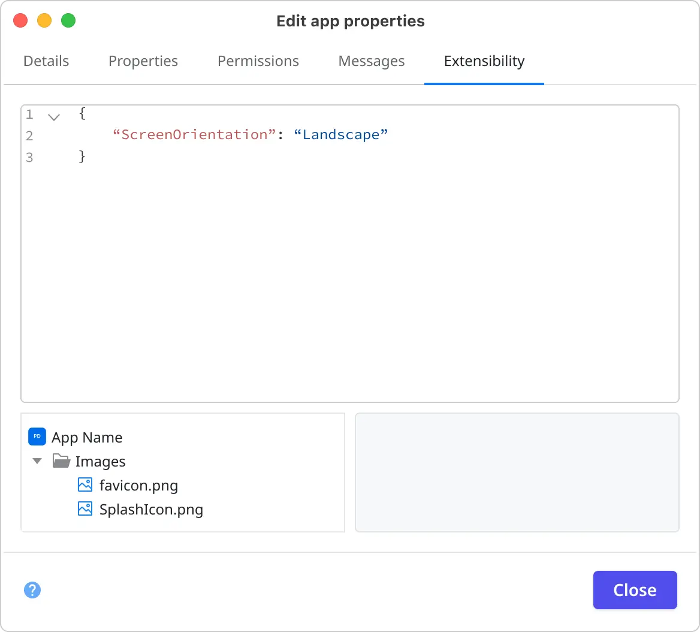
  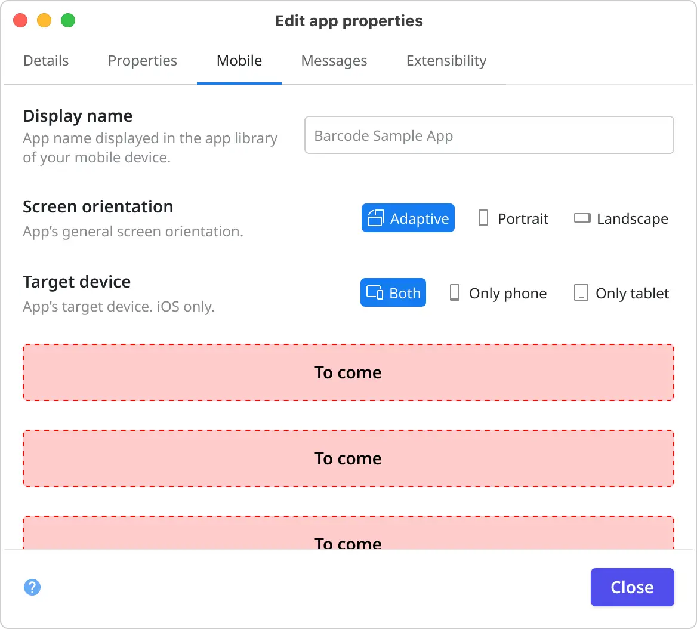
</Gallery>

More and more mobile settings were being designed. The Mobile tab, built to hold just a few static settings, was now expected to support a growing, dynamic list. It lacked structure, flexibility, and a sustainable framework for scale. This triggered the need for a complete redesign — one that could accommodate both current demands and the future expansion of mobile app settings.

## Technical Discovery

Before jumping into design, we needed a deeper technical understanding of how settings were structured and consumed by the platform. This included:

- How settings were defined, stored, and accessed internall
- What logic controlled their visibility and availability per app type
- How settings were currently being mapped via the extensibility layer
- How platform-specific settings (iOS vs. Android) were handled
- What limitations existed in dynamically rendering or injecting settings

We partnered closely with engineering to uncover the technical constraints and opportunities behind the current implementation. One key takeaway was that while settings could be deeply platform-dependent or app-specific, the internal architecture was flexible enough to support dynamic rendering based on context (e.g., app type or target platform).

This gave us confidence to move forward with a more modular and scalable approach — one where the UI could adapt based on the technical definition of each setting.

## Systems Thinking & OOUX

Given the increasing number of app settings, platforms, and configuration rules we had to support, we knew that jumping straight into UI design would be risky. We needed clarity not just on the interface, but on the structure behind it. That’s why we started with Systems Thinking and Object-Oriented UX (OOUX) — two complementary approaches that helped us design for scale, clarity, and long-term flexibility.

With Systems Thinking, we stepped back to look at the entire configuration ecosystem. We mapped how settings are defined, grouped, and exposed depending on the app type (e.g., mobile, web, library), platform (iOS or Android), MABS version, and plugin dependencies. This helped us understand the broader architecture, spot patterns, and anticipate edge cases before they emerged.

From there, we used OOUX to define the core objects, relationships, and attributes that would guide our product structure. Our object model included entities like:

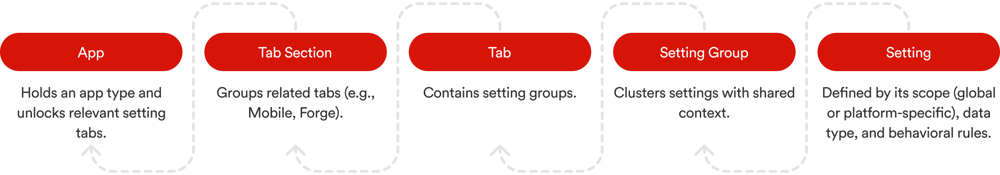

This modeling exercise gave us a shared language across design, product, and engineering, and ensured that new settings could be introduced with consistency and contextual logic — no matter how complex the system grows.

## Research

### Usage data analysis

We queried telemetry data to understand how mobile settings were being used across thousands of production apps. This helped us identify which settings were most common, which ones varied per platform (iOS vs. Android), and how often users applied different values for the same setting across platforms.

This research validated our initial hypothesis: a single solution would not fit all. Instead, we needed a modular, context-aware system that could adapt based on app type, platform, and developer needs — while remaining intuitive and scalable.

<Gallery narrow>
  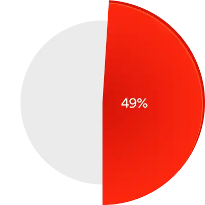
  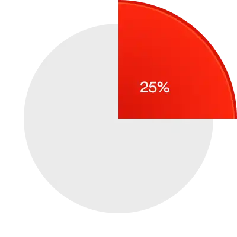
  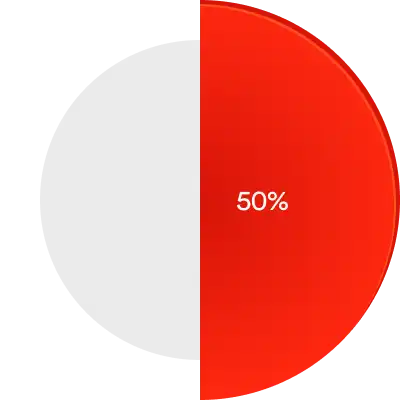
</Gallery>

### Benchmarking other platforms

We studied how other development tools and operating systems (like macOS, Slack, Zoom, and VS Code) organize complex configuration settings. We focused on layout patterns, component usage, grouping strategies, and tab structures. This gave us references for scalable and familiar patterns developers are already used to.

<Slideshow>
  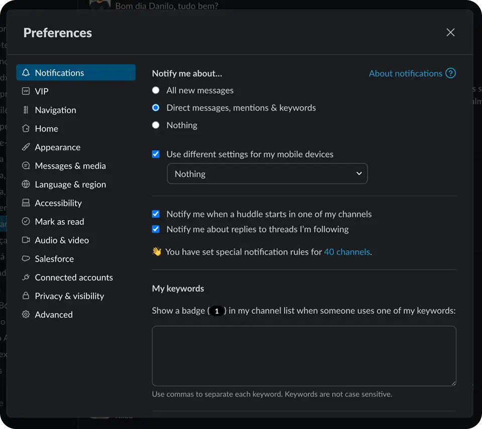
  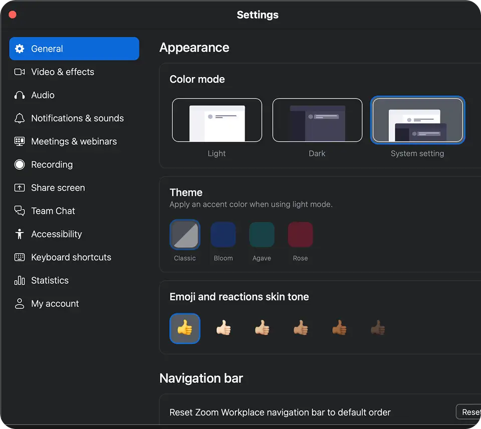
  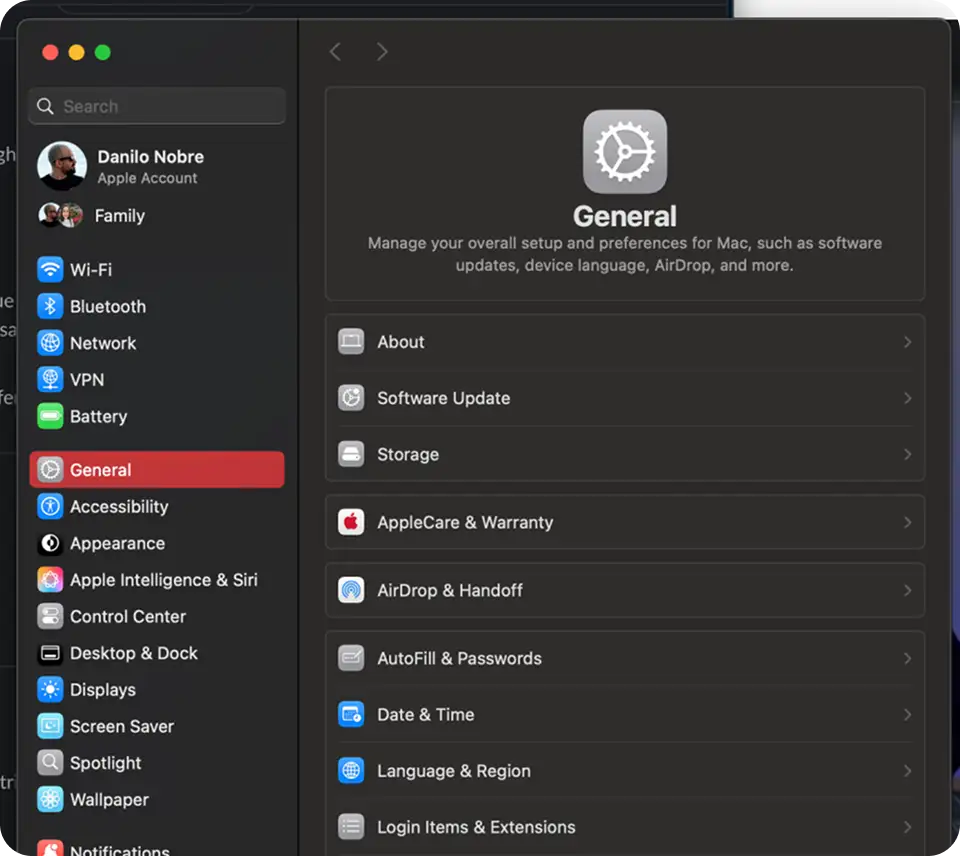
  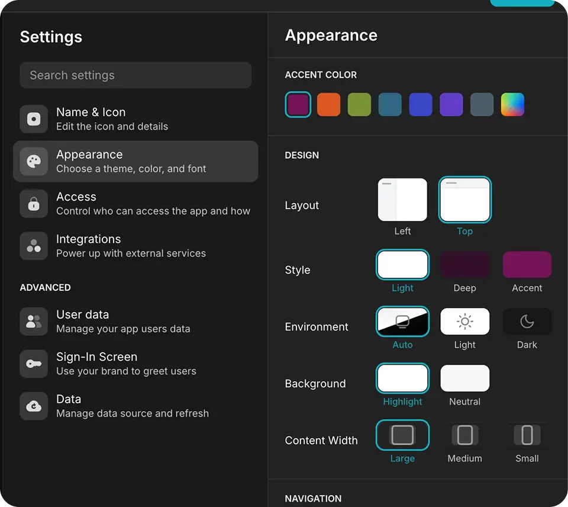
</Slideshow>

### Internal user feedback

Throughout the early phases, we ran design critiques and async validation rounds with internal UXers and developers. These conversations helped surface expectations about search behavior, field widths, platform specificity, and UI affordances that shaped our early prototypes.

This research validated our initial hypothesis: a single solution would not fit all. Instead, we needed a modular, context-aware system that could adapt based on app type, platform, and developer needs — while remaining intuitive and scalable.

###### Ideation

## Workshop

To explore the future of app settings, we ran a collaborative workshop involving two separate groups of cross-functional peers — including UX designers, PMs, and engineers. Each group was tasked with co-creating a solution for where and how a new settings experience should live.

Each group worked independently, ideating and sketching possible directions. Despite different paths of reasoning, both teams converged on the same outcome: the ideal solution was not to create a separate settings experience, but to redesign the current App Properties dialog entirely — making it scalable, contextual, and applicable to any app type.

This convergence gave us a strong signal that the problem and the opportunity were bigger than just mobile. The new vision would be a unified, long-term structure for managing settings across mobile, web, and libraries — opening the door for a much more sustainable and flexible future.

<Gallery shadows>
  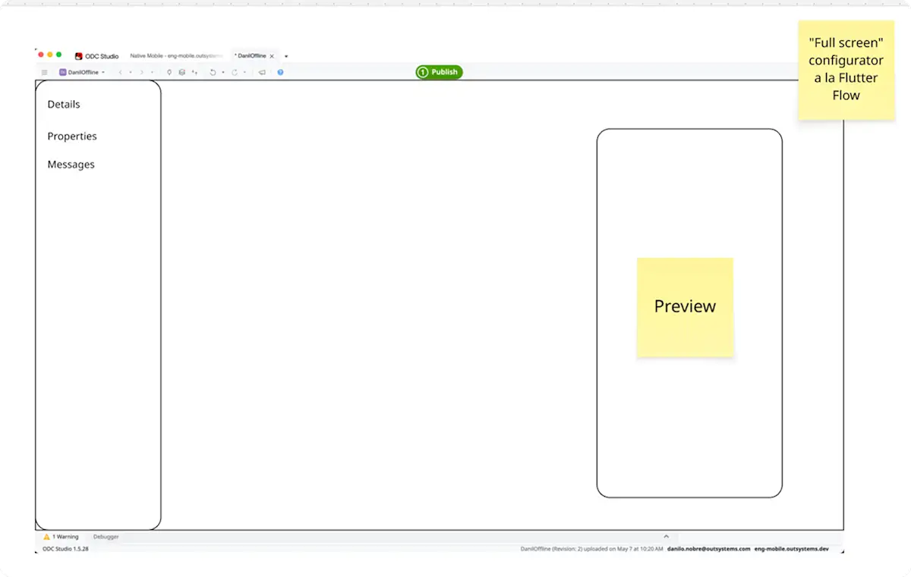
  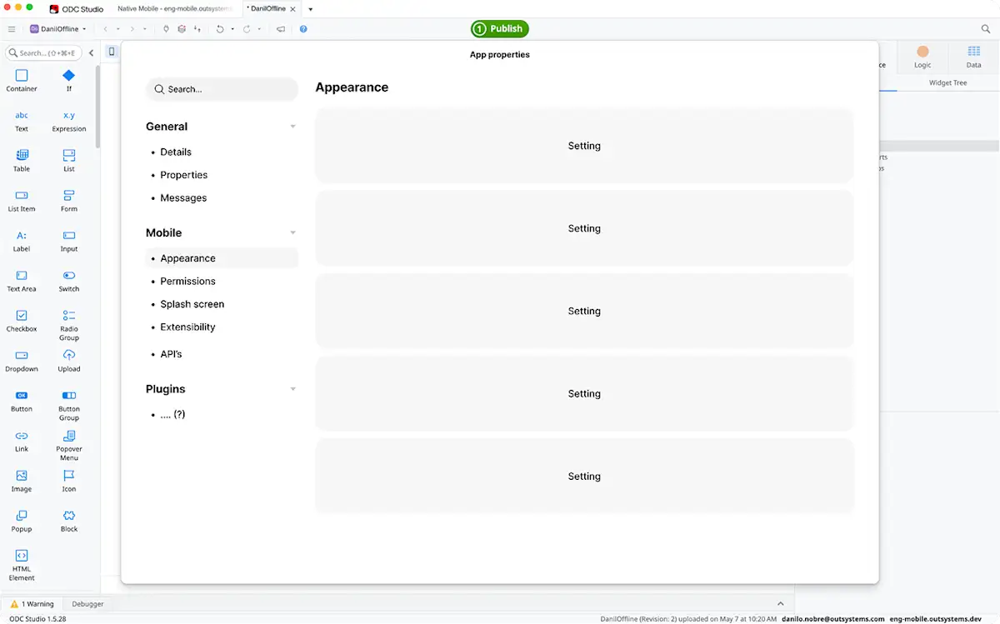
</Gallery>

###### Prototype

## Design Strategy

With a clear direction to redesign the entire app settings experience, our design strategy focused on scalability, contextuality, and visual clarity.

We treated the settings system as a product within the product — one that needed to adapt to different app types, grow over time, and remain usable across a wide range of use cases, from simple dropdowns to platform-dependent fields and plugin-injected settings.

Some key principles that guided our design strategy:

#### Progressive contextualization
Users should only see the settings that matter to their current app type (mobile, web, library), reducing cognitive load and helping them focus.

#### Consistent yet flexible layout
The visual system needed to support text inputs, toggles, multi-selects, nested settings, and even custom components — all within a coherent layout structure.

#### Clear grouping and hierarchy
We established a visual language for organizing settings within tabs, using spacing and separators to signal related fields and logical boundaries.

#### Sustainable UX/UI decisions
Each new design decision was made with future extensibility in mind, ensuring that new settings could be added organically without breaking consistency.

By treating this effort as the foundation for a full Settings Design System, we shifted our mindset from designing screens to designing rules — enabling clarity and maintainability long term.

## Dialog Structure & Interaction Model

We reimagined the App Settings dialog to support a more powerful, scalable structure — while preserving a lightweight, familiar experience for developers.

Key design choices:

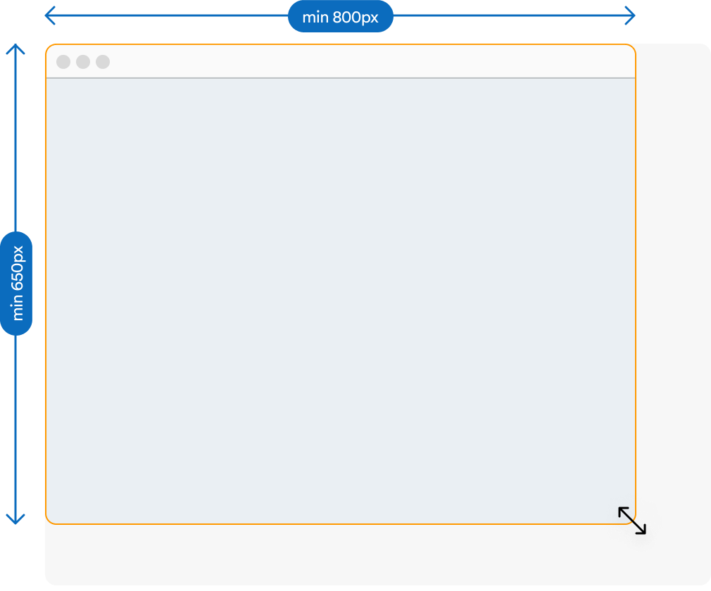
#### Resizable dialog
The new dialog supports resizing, with a minimum width of 800px and minimum height of 650px. This gives developers control over how much space they want, while preserving layout consistency.

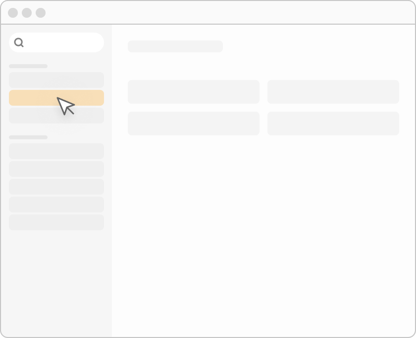
#### Sidebar-based navigation
The left sidebar houses tabs organized by section (e.g., Mobile, Forge), with only the relevant tabs shown based on the current app type. This keeps the interface lean and contextual.

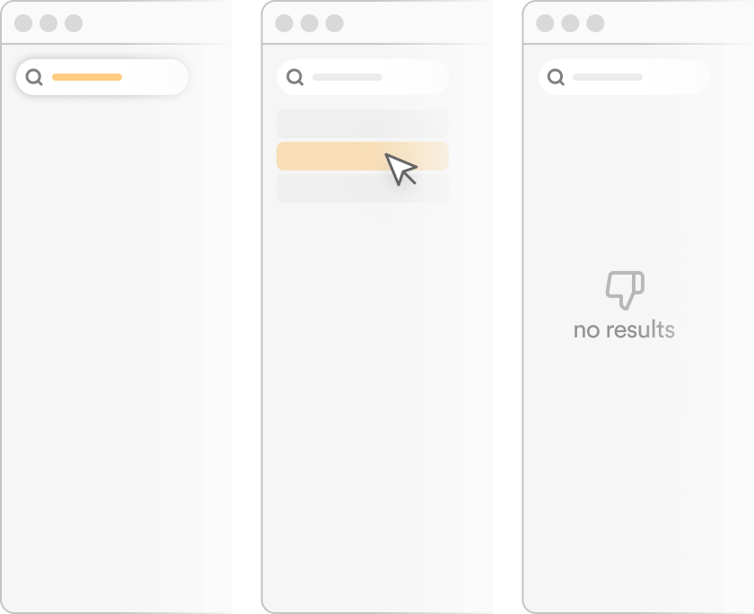
#### Search inside sidebar
We introduced a search input at the top of the sidebar. As users type, results are filtered live, and clicking a result opens the corresponding tab. The search does not take over the UI — it keeps the sidebar context visible at all times.

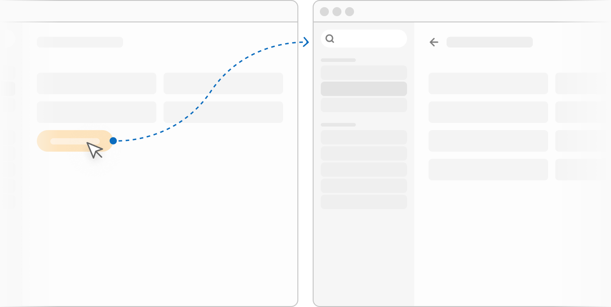
#### Subpages for complex settings
For cases where a setting needs multiple inputs or advanced logic, we designed a “subpage” model. These entries appear as rows with a right arrow icon and open into a focused view while maintaining full context.

These UI rules became the foundation of a reusable, adaptable design system for settings — one capable of handling growth without degrading the user experience.

## UI Decisions
As we moved into interface design, we faced a critical challenge: how to balance flexibility and simplicity in a space that needed to support dozens of configurations, multiple platforms, and varied data types.

We made key decisions to ensure visual coherence and usability across the system:

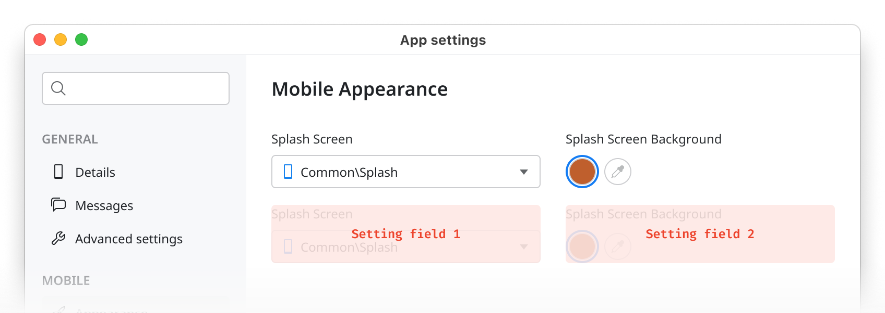
#### Maximum of two fields per row
To maintain readability, we limited layout density. Fields can be displayed side-by-side only when they are contextually related.

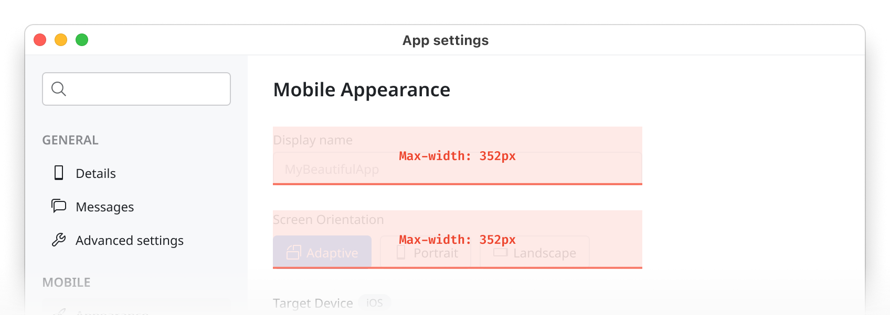
#### Field max-width: 352px;
Aligned with the product’s grid, we defined a width constraint to avoid overly stretched fields in resizable dialogs. This width represents two-thirds of the content area in the default dialog size.

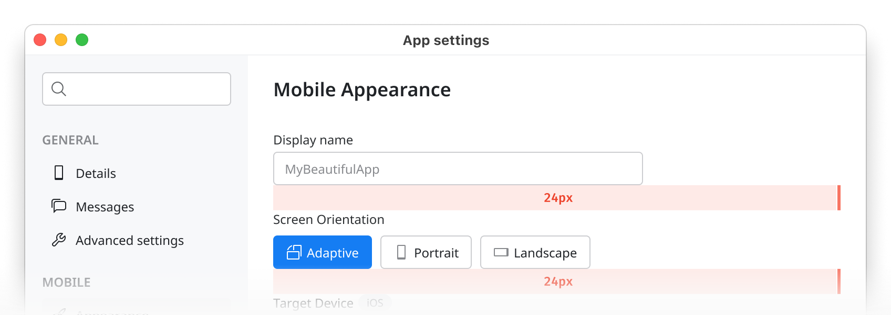
#### Three levels of grouping
Light spacing between related fields, Larger spacing for distinct groups, and Separator line for strong visual separation

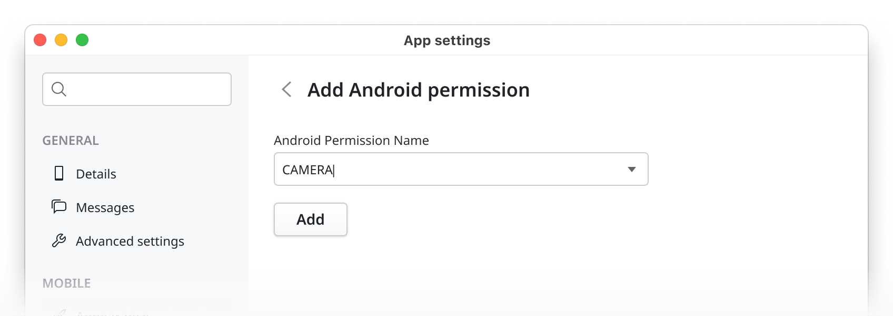
#### Single-line vs. subpage settings
While most settings are inline, we introduced a subpage model for more complex configurations. These settings appear as a row with a right arrow icon and open into their own focused subpage when clicked.

These UI rules became the foundation of a reusable, adaptable design system for settings — one capable of handling growth without degrading the user experience.

## Advanced Use Cases

Designing for scalability meant going beyond the basics. We had to account for advanced, technical use cases that would stretch the UI model and influence architectural decisions. Two major scenarios stood out:

<Gallery shadows>
  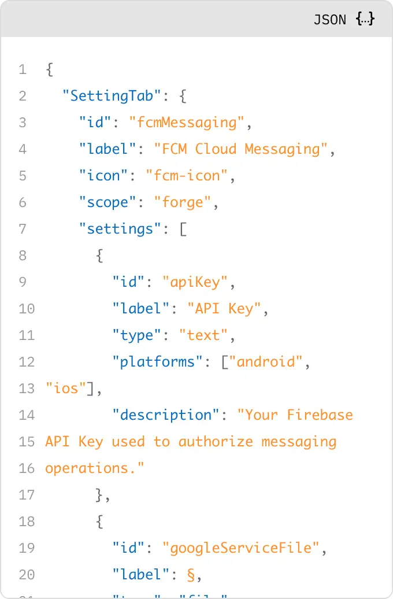
  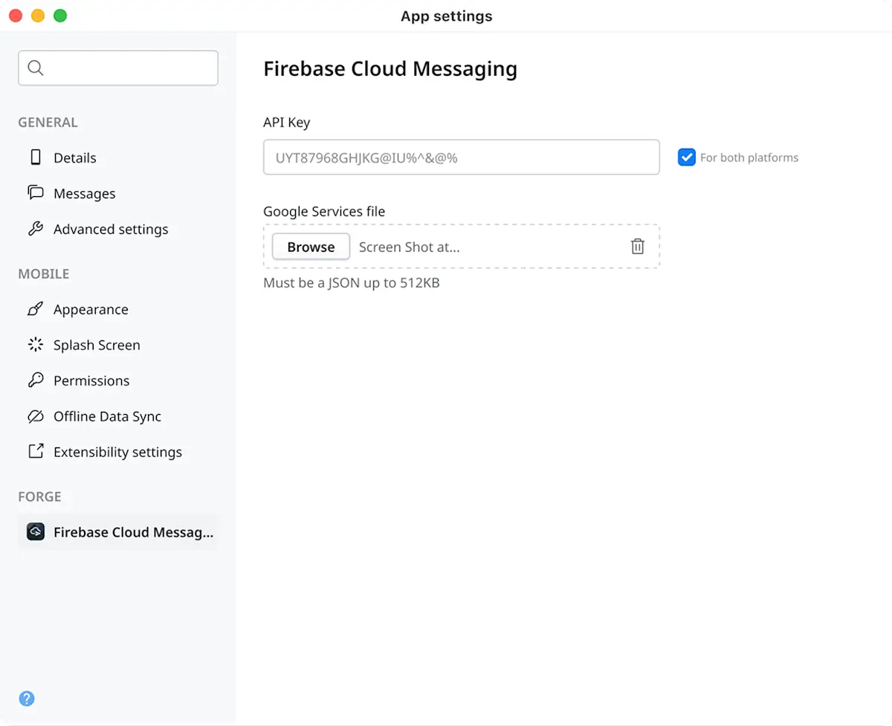
</Gallery>

### Plugins injecting settings

OutSystems allows apps to consume external libraries (known as Forge components), which can require their own configuration settings. Our design had to support a system where:

- Each plugin can inject its own settings into the App Settings dialog
- Those settings are displayed in a dedicated tab, labeled with the plugin’s name and icon
- The plugin settings appear under a new “Forge” section in the sidebar

This gave plugin developers autonomy while preserving consistency and structure in the UI.

<Gallery shadows>
  
  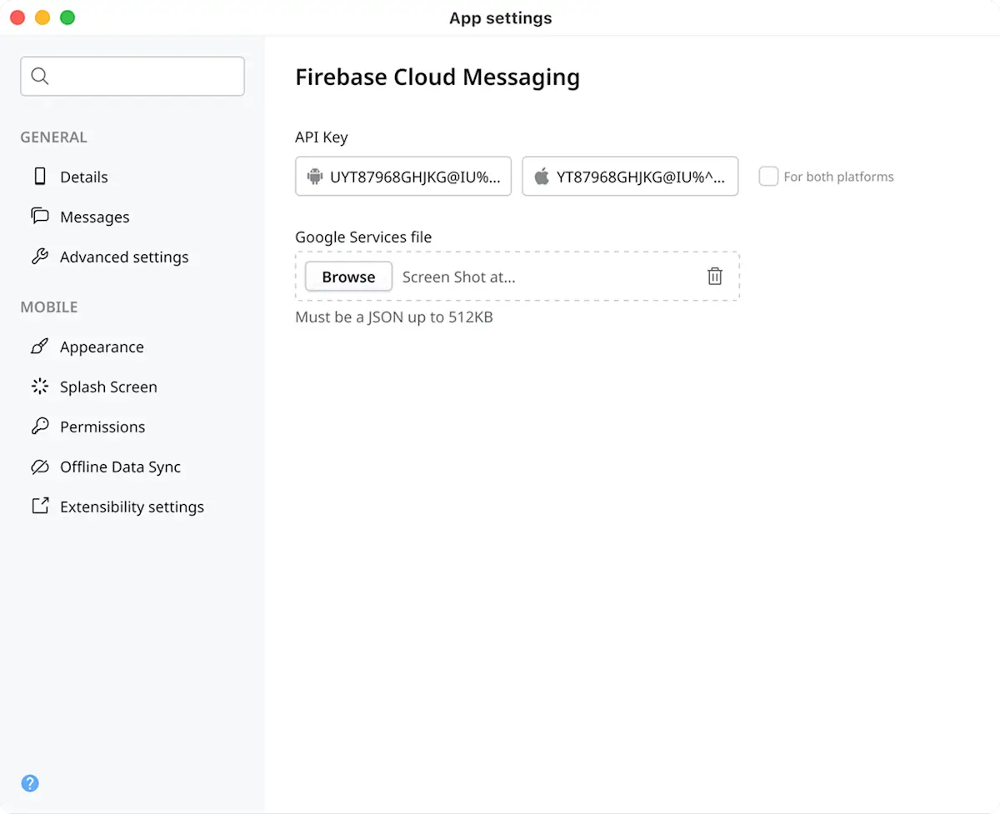
</Gallery>

### Settings per platform (Android & iOS)

Many mobile settings behave differently depending on the platform. Some are exclusive to iOS or Android, while others apply to both but allow for different values. We explored multiple UX approaches to handle this, including duplicating settings or filtering by platform

After user validation and internal debate, we adopted a flexible yet simple model:

- Settings that support platform-specific values show a toggle
- By default, a single field is shown (shared value)
- Disabling the toggle splits the field into two: one for Android, one for iOS

This pattern serves the majority use case (same value for both) while still supporting differentiation when needed — without cluttering the UI by default.

## Final design

Once our structure, interaction patterns, and UI rules were solidified, we moved into high-fidelity design — building a complete, polished prototype of the new App Settings experience.

<Slideshow shadows>
  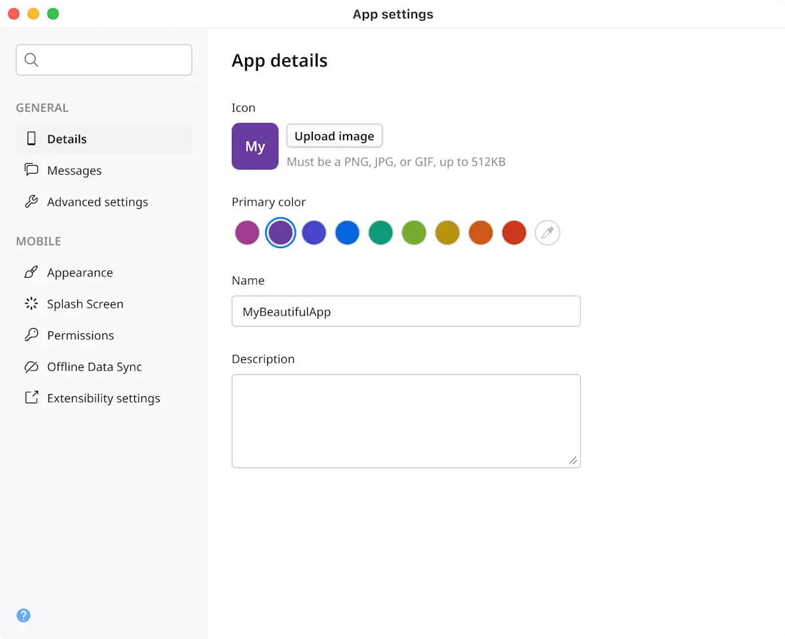
  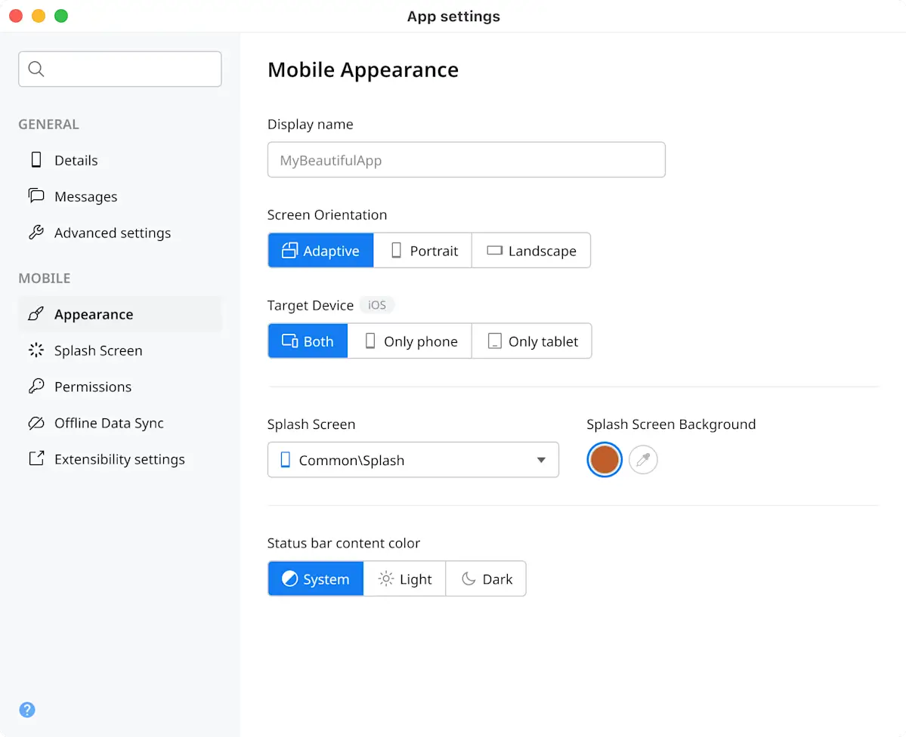
  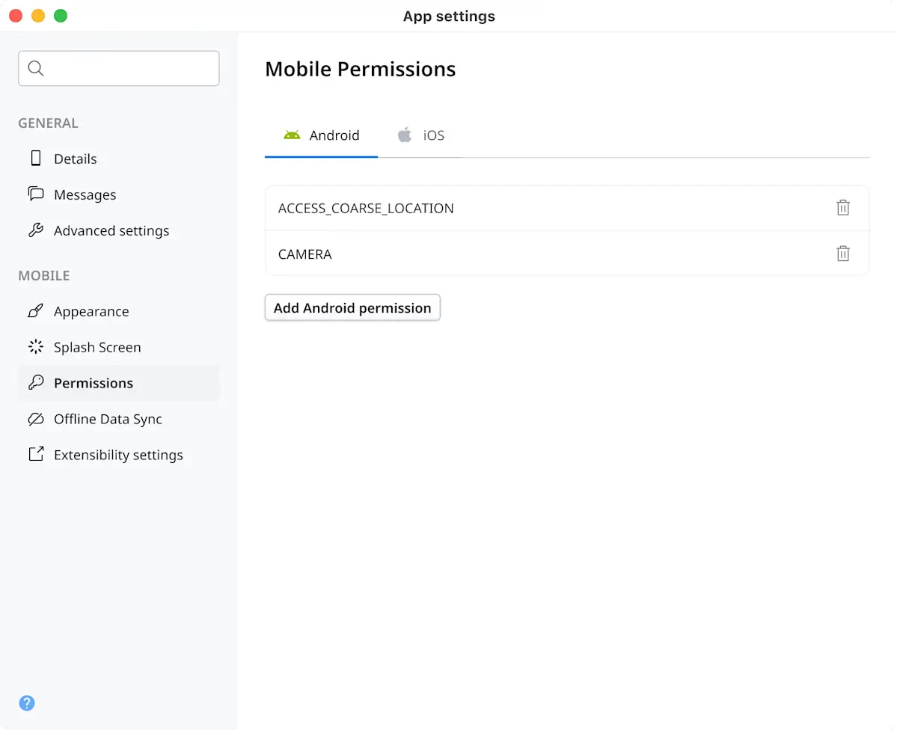
  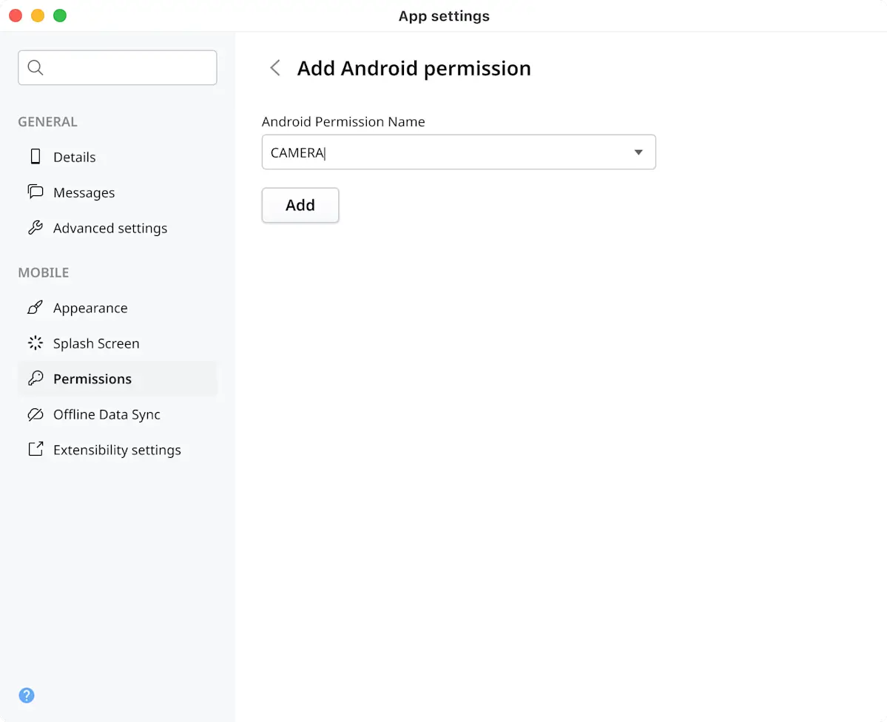
  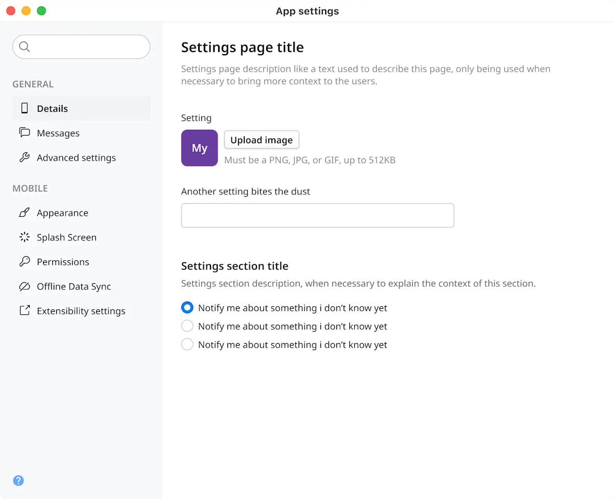
</Slideshow>

###### Validation

## User Validation

To ensure the new experience delivered on its promise of clarity and scalability, we ran a lightweight validation plan focused on findability, layout clarity, and naming.

We tested a clickable high-fidelity prototype with internal developers and UXers using guided tasks and open-ended exploration. The validation included:

#### Search & Navigation Behavior
Participants tested the new sidebar search and navigation model. Results showed users were able to find and access settings quickly, with minimal confusion about search behavior or context switching.

#### Field Width & Layout Preferences
We tested the visual rhythm of using a 352px max-width and limiting to two fields per row. Feedback confirmed that this structure was readable and aligned with expected patterns, even when the dialog was resized.

#### Dialog Naming
We validated options like App Properties, App Configuration, and App Settings. App Settings was consistently recognized as the clearest and most intuitive name.

Overall, the validation confirmed that the new system was intuitive, adaptable, and well-aligned with developer workflows, giving us confidence to move forward with implementation.

###### Wrap up

## Handoff

The design work didn’t end with the prototype. To ensure smooth implementation and future scalability, we invested in a thorough handoff process across tools and teams.

- The entire project is fully documented in a dedicated Confluence page, detailing the rationale behind decisions, design rules, interaction models, and edge cases.
- The Figma file includes a centralized documentation page outlining the full user experience, enriched with notes, alerts, variations, and platform-specific behaviors.
- We also hosted official presentations to onboard other teams, ensuring alignment and visibility across UX, product, and engineering.
- Lastly, we actively support implementation by participating in team ceremonies and design/dev syncs, helping bring the vision to life with accuracy and care.

This handoff structure not only supports delivery, but also sets a foundation for others to extend the system confidently in the future.
