###### Discovery

## Where we were before

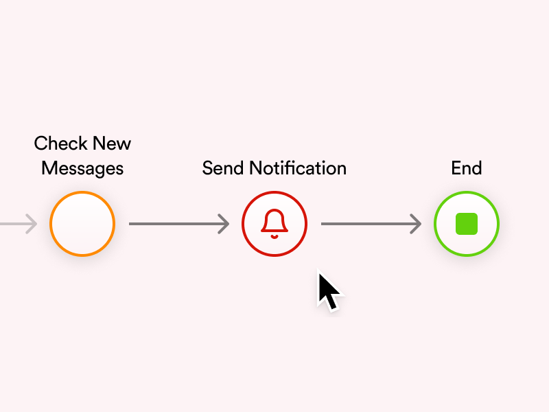

OutSystems is a low-code development platform where developers build app logic through visual flows — sequences of actions chained together to define what the app does at each step.

Before this project, sending a push notification meant a developer had to manually drop a "Send Notification" action into one of those flows, wire up the Firebase integration themselves, define the target audience in code, and repeat the whole thing for every new use case.

## Uncovering the "what" of this initiative

A comprehensive effort to modernize and enhance the OutSystems-supported solution for utilizing push notification functionalities in mobile applications, alongside the development of sample apps covering all features within a real-world use case.

### How I planned the research

A comprehensive effort to modernize and enhance the OutSystems-supported solution for utilizing push notification functionalities in mobile applications, alongside the development of sample apps covering all features within a real-world use case.

A comprehensive effort to modernize and enhance the OutSystems-supported solution for utilizing push notification functionalities in mobile applications, alongside the development of sample apps covering all features within a real-world use case.

A comprehensive effort to modernize and enhance the OutSystems-supported solution for utilizing push notification functionalities in mobile applications, alongside the development of sample apps covering all features within a real-world use case.

### Digesting insights and aligning stakeholders

<ResearchResults>
  <ResearchResult percentage="85" text="developed push notification composers, for marketing use cases." />
  <ResearchResult percentage="71" text="developed segmentation integrated with an OutSystem app." />
  <ResearchResult percentage="15" text="developed segmentation importing a spreadsheet file." />
  <ResearchResult percentage="100" text="did not use the Firebase dedicated console for sending notification." />
</ResearchResults>

Upon synthesizing the insights gathered, we engaged in a collaborative process with stakeholders to define the following key opportunities to aim in the next phase of our push notification solution.

#### Opportunity #1: Introducing a Push Notification Composer

The first challenge centered on the recurring need to create a push notification composer – an application tasked with crafting and scheduling messages for targeted user groups. This requirement was especially prevalent among customers employing push notifications in their marketing strategies.

#### Opportunity #2: Streamlined user segmentation

The foremost challenge identified was user segmentation, even because Firebase lacked a built-in feature for segmenting message recipients. Consequently, our developers had to continually develop segmentation solutions within the OutSystems app.

This point holds particular significance because once addressed, it empowers OutSystems customers to send push notification messages to custom audiences – groups of individuals specifically defined by the customer as strategically valuable to engage. This capability has the potential to significantly enhance the effectiveness of their marketing strategies and drive more impactful outcomes.

With these insights in mind, we have aligned our next steps in the push notification solution.

<Highlight icon="Target">
  Our focus will be on designing a user-friendly push notification composer application that streamlines receiver segmentation. This application is geared towards non-technical users, with a primary aim of empowering marketing teams to effectively utilize this feature in their strategies.
</Highlight>

###### Ideating

## Let it rip

After further technical exploration and the competitor analysis, we've arrived at the moment we've all been waiting for — the moment to roll up our sleeves and get to drawn.

### A Collaborative Endeavor: Many Hands at Work

With confidence in the information at hand, it was time to put our ideas into action. I facilitated numerous sessions involving my UX colleagues, developers, the tech lead, the product owner, and the product manager. Together, we embarked on the brainstorming phase, generating a multitude of sketches and concepts aimed at achieving our solution's opportunities. These collaborative sessions encompassed diverse aspects, including technical feasibility, user journeys, copywriting considerations, and more.

To guide these sessions, I constructed an Impact Effort Matrix to organize ideas for each opportunity and provide a clear visual aid for alignment.

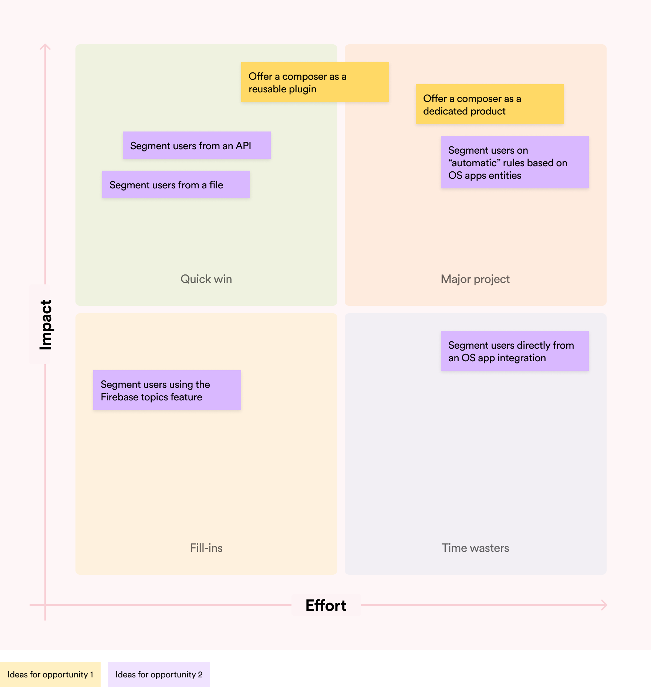

Then we began to witness our creation taking shape. This evolution led us to formulate our solution hypothesis, which is as follows:

<HypothesisStatement
  action="delivering a supported push notification composer application as a plugin"
  alignment="OutSystems' monetization strategy"
  value="providing developers with a versatile, customizable tool that is inherently equipped to send push notifications to both the entire user database and segmented user groups"
  outcome="drive the increased utilization of OutSystems app resources"
  impact="enhancing monetization efforts"
  success="it is widely adopted by our customers"
/>
###### Prototyping

## It's getting serious!

With our solution in mind, we've reached the pivotal moment of transforming our plan into a tangible product.

### Journey in the OutSystems ecosystem

Following our exploration and collaborative efforts, let's embark on the journey of the Composer within the OutSystems ecosystem, linking it with the two vital components that give the Composer its purpose:

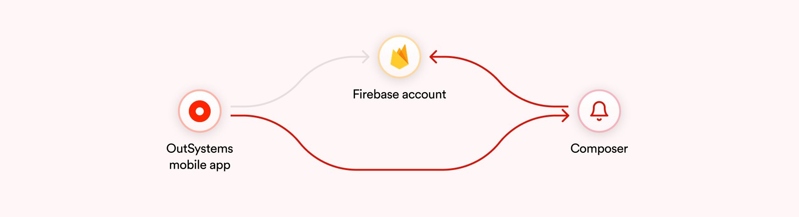

1 - The OutSystems App: This serves as the platform that enables customers to segment their users effectively.

2 - The Firebase Account: This crucial tool is responsible for the actual delivery of notifications and must be the same account integrated with the OutSystems App.

By connecting the Composer with these applications, we breathe life into its purpose and functionality.

### Target Personas: Defining the "Who"

With a defined vision and placement for our solution, it's time to dive into crafting the composer's inner workings. To bring it to life successfully, we must begin by understanding its intended users.

#### OutSystems Mobile Developer persona

The developer's role is pivotal in the initial setup of the composer. Their primary responsibilities include installing the plugin into the OutSystems account and subsequently integrating it with the Firebase account. Additionally, to achieve our second goal of segmentation, they play a crucial role in configuring everything necessary to segment users from the OutSystems app into the composer.

#### Marketing Analyst persona

The marketing analyst takes the reins on the other side of the spectrum. Their responsibilities revolve around actively using the composer, crafting notifications, and sending them to specific user groups. They operate in alignment with the marketing strategy devised by the team, ensuring that the messages effectively reach their intended audiences.

### User journey

With all the pieces in place, it's time to connect them and create a solution that aligns seamlessly with all of our goals.

First and foremost, our initial opportunity was to design a push notification composer integrated with Firebase. Here's a breakdown of the solution's features:

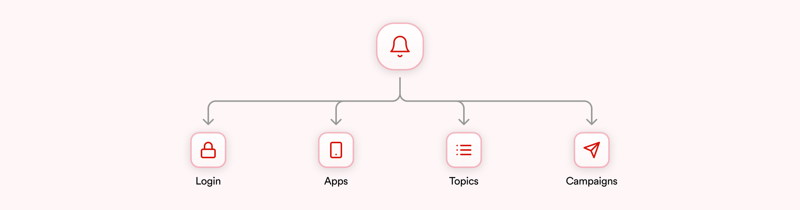

#### Apps

Once logged in, users can configure a Firebase account within the composer. The "Apps" feature allows users to manage apps inside the composer, each corresponding to a mobile app in the Firebase account.

#### Topics

"Topics" are a Firebase feature enabling developers to subscribe users to specific topics based on app logic. This allows notifications to be sent to all users subscribed to a chosen topic. While not a top priority to match our opportunities, we've included this feature to accommodate current OutSystems customers using this method for segmentation due to the lack of a more robust solution.

#### Campaigns

The heart of our initial goals, "Campaigns" provide a comprehensive way to manage push notifications. Each campaign encompasses message details (notification title, content, image, custom sounds, and custom actions), target recipients, and scheduling options. This empowers marketing personnel to send notifications instantly or at specified future dates and times. By default, the composer offers segmentation by the device's operating system (iOS or Android).

<Highlight icon="CheckCircle" title="Opportunity #1">
  Considering the "Apps" and "Campaigns" features, we've achieved our first opportunity — a push notification composer that enables marketing teams to manage notifications independently, without the need for coding, only point-and-click interactions.
</Highlight>

To pursue our second opportunity (User Segmentation), we introduced the "Audiences" feature.

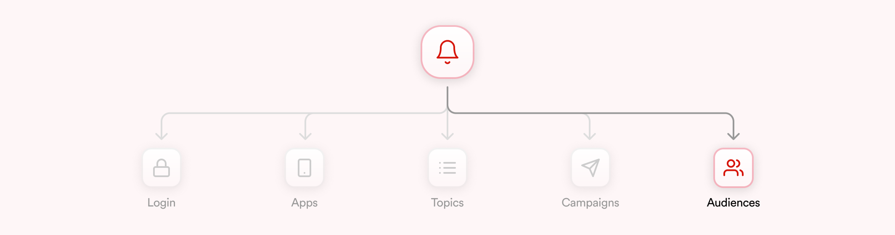

### Audiences

"Audiences" represent our segmentation entities, allowing users to create groups of notification recipients. This feature holds immense potential, as it simplifies the process for OutSystems developers to group users within the mobile app based on business rules. These groups can then be sent to the composer. This empowers marketing teams to request specific user groups from the development team. Once these groups are created as "Audiences," the marketing team gains full autonomy to send push notifications to them.

An "Audience" receives a list of users for notification delivery, and we offer two integration methods:

1 - File Export: In the OutSystems mobile app, developers can filter the required users and send their device IDs (generated by Firebase integration) to the composer in a file format, such as .csv or .txt. The marketing team can then upload this file into the composer.
2 - API Integration: In the OutSystems mobile app, developers filter users and expose their device IDs via a REST API. This approach allows developers or the marketing team to create an audience connected to this API with credentials. Consequently, the user group is automatically synchronized with an "Audience."

<Highlight icon="CheckCircle" title="Opportunity #2">
  With this robust solution, we empower customers to segment notification recipients based on their specific business rules within the OutSystems app, effectively achieving our second objective.
</Highlight>

### Low-fidelity prototype

Continuing along our user journey, we've now arrived at the stage where we transform our vision into tangible low-fidelity prototypes.

<Slideshow>
  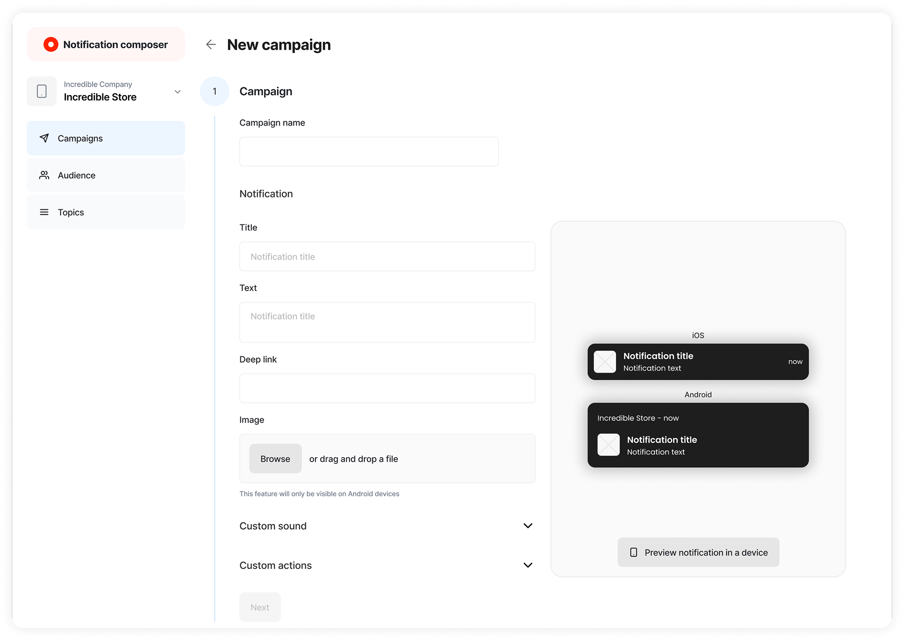
  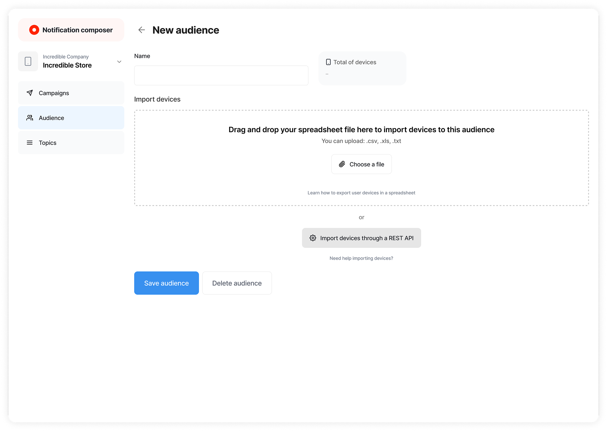
  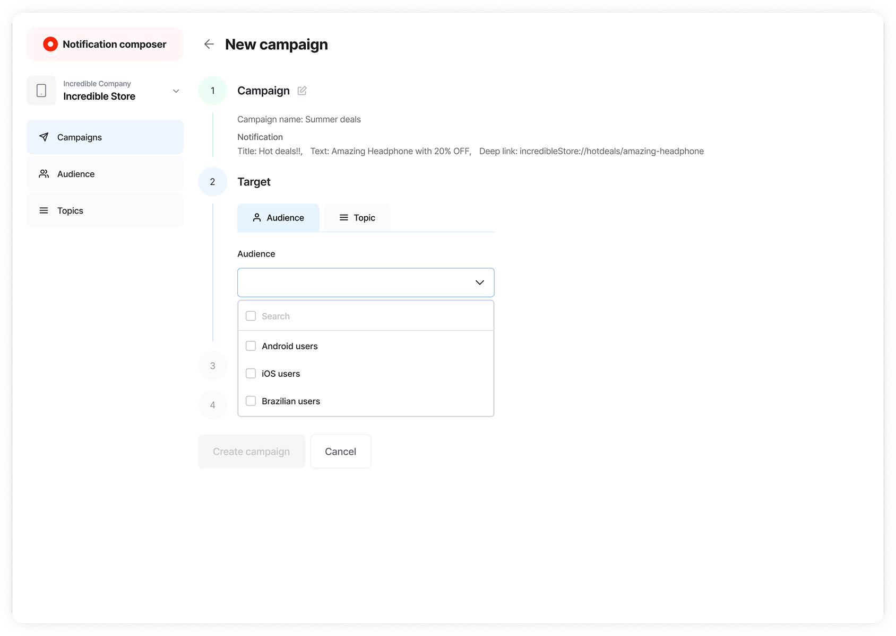
  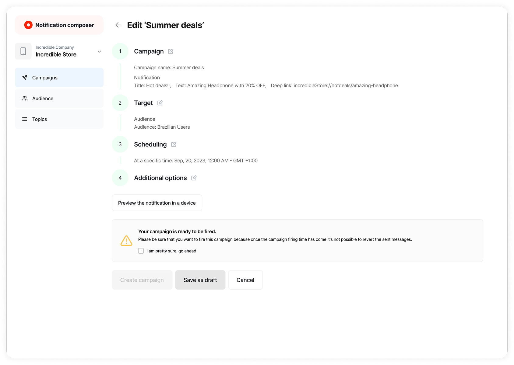
</Slideshow>

###### Validating

## Mitigating Risks

Designing is undeniably captivating, and I have a deep appreciation for it. However, we must also consider the process of bringing our designs to life and the potential costs and consequences that may arise in the event of failure. Therefore, it's imperative that we validate our solution before diving into development, allowing us to gather feedback swiftly without significant technical investment.

### Planning the validation

Based on our two personas, I've structured the validation process into two distinct phases, each tailored to the unique journeys and objectives within the composer.

#### Phase 1 — Developer validation

For the developer's journey, my focus during validation is twofold:

1 - Validate the feature itself. I aim to understand whether developers, who are responsible for creating push notification composers, would opt to use our solution instead of building one from scratch, as they currently do.

2 - Validate technical requirements. The composer encompasses various technical requirements, and it's crucial to ascertain if they align with the developers' needs. For instance, we provide two user segmentation methods – file import and API connection. I want to ensure these options are viable and whether developers might require additional choices. What's the effort involved in integrating these options into the OutSystems app? Balancing the benefits against the technical effort is essential.

I conducted this validation with OutSystems mobile developers in two phases:

1 - Interviews and usability tests held on-site with 13 developers at the OutSystems office.

2 - Remote interviews and usability tests involving 6 developers, including 3 who were previously interviewed during the discovery phase.

#### Phase 2 — Marketing analyst validation

In the marketing analyst's journey, beyond assessing usability and copy, I aim to validate whether a marketing persona would find it feasible to manage segmentation using the outputs generated by developers. Would a marketing analyst be comfortable importing a file or connecting via API if they have the required credentials? Our objective is to gauge the usefulness and user-friendliness of the segmentation feature for this audience.

I conducted this validation with 10 users through usertesting.com, with 5 participants navigating the journey requiring file-based segmentation and the remaining 5 focusing on API-based segmentation.

### Prototyping the tests

This is where my Figma skills shine, and I enjoy creating intricate design maps to guide our testing.

<Slideshow shadows>
  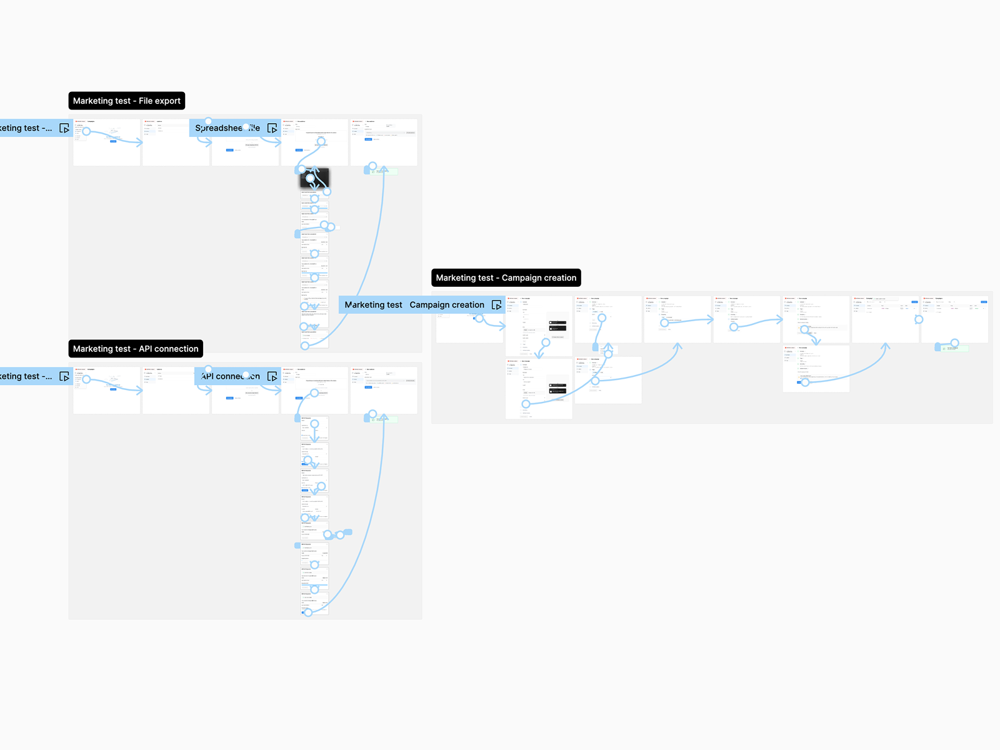
  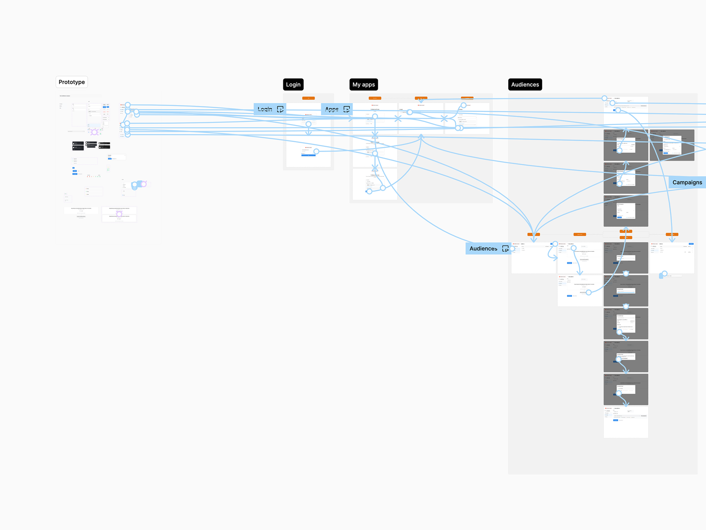
</Slideshow>

### Analyzing and Adapting the Insights

Following this comprehensive process, it's time to consolidate the insights we've garnered and make any necessary adjustments to our solution. Equally crucial is aligning these outcomes with our stakeholders to ensure collective confidence in the solution's readiness to proceed.

<ResearchBlock variant="quote" question="If you had our solution available when you were developing your push notifications, would you consider using it in its entirety or, at the very least, incorporating some of its elements?">
Absolutely, I constructed my entire system solely around the API, and with your solution I would have had everything out-of-the-box into a highly user-friendly experience.
</ResearchBlock>

<ResearchBlock variant="quote" question="Do you see yourself using this solution in the future? Why?">
Definitely, mainly because I don't have the luxury of having a UX designer in my team and, apart from solving the sending push notification use case, this solution is incredibly simple for non-tech users.
</ResearchBlock>

<ResearchBlock variant="rating" question="Overall, how do you rate the experience?" rating="6.5" maxRating="7">
</ResearchBlock>

<Highlight icon="ThumbsUp">
  The validation results have significantly boosted our confidence in seizing the opportunities before us.
  This leaves us feeling quite confident about proceeding with the development of this solution.
</Highlight>

###### Final design

## Wrapping up

### Final UI

Now that we have a high level of confidence in our solution, it's essential to integrate it into the final UI, using the OutSystems UI design system, specifically used in OutSystems plugins. Adhering to this design system is crucial to ensure the level of consistency we expect across the entire OutSystems platform.

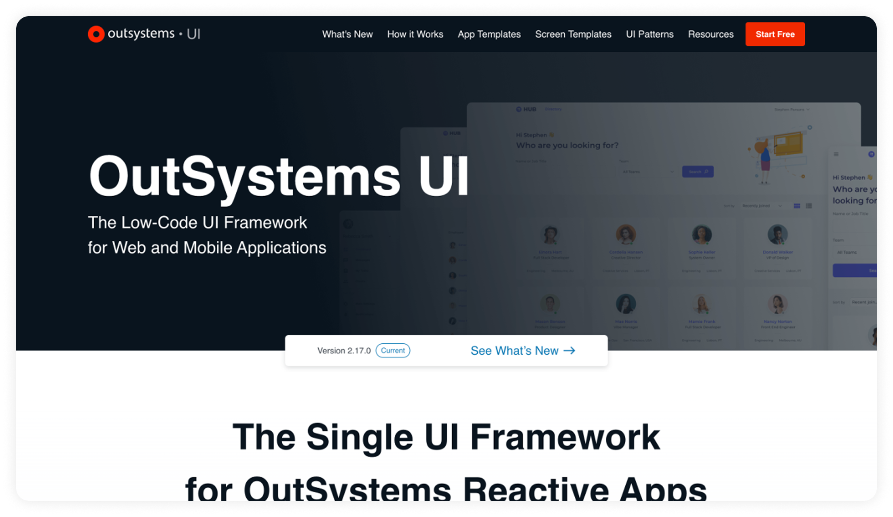

### Measurement plan

For measurement, at this time we already have all of the metrics we need and they must end up in a dashboard to be consumed constantly in my bi-weekly iteration for each initiative.

### Handoff

Last but not least, it's time to deliver our solution to the development team. It's very important to say that at this point the development team is well aligned with this initiative — we had tons of meetings during the process and I also chose one or two developers to act as my technical guides, so I passed through this whole project consulting them regarding technical stuff.

But, anyway, we need to formally deliver our design, and I like to do a proper presentation containing a slide deck and a document explaining the whole initiative and the experience we are proposing.

After this formal presentation and its deliverables, I will always be available for meetings for enlightening everything they need on the solution, and I also participate in their dailies one or two days per week, just to be sure they don't need me for something.