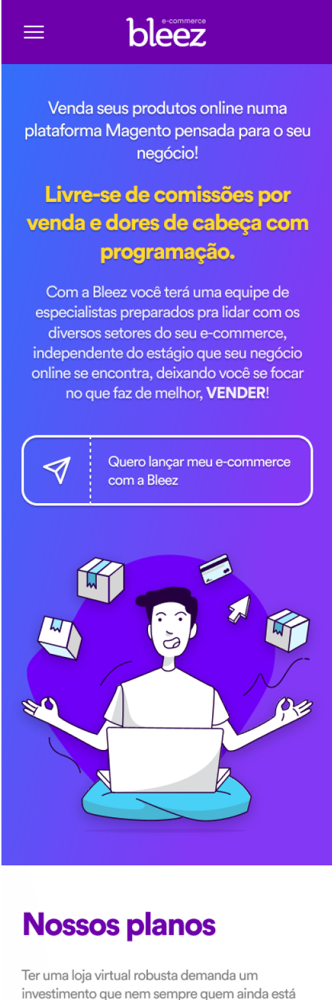
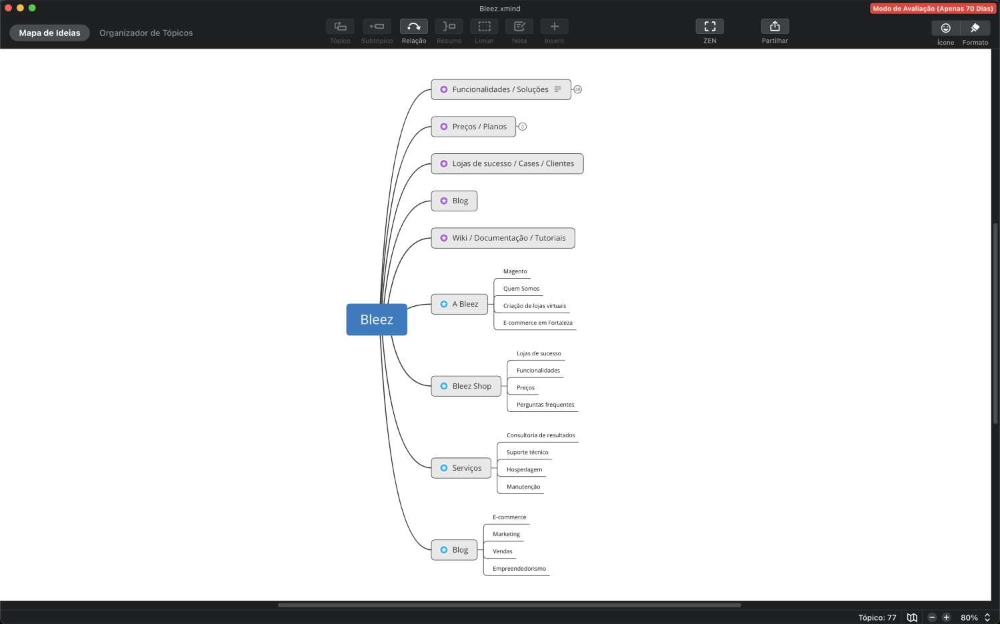

## Problem

The biggest challenge selling Bleez E-commerce was to explain to the market what Bleez really do, because the biggest part of the local market don't understand technically how an e-commerce works, and this makes more difficult explain that Bleez only act with the platform, in other words, that Bleez only sells the system they need to display their products and capture a sale.

## The journey

In this point i think my work as designer was so much furthered, because since i was the frontman of company i had direct and constant contact with the users, either by business meetings or in phone callings, for exemple, and this allowed me to get fast answers to the questions the team made, after this we design experiments and after implemented we can test them even faster.

## Planning

I love to begin my plans with mind maps, that's the easy and quickly way to organize my thoughts and even easier to explain to team.

## Personas

Create the personas was one of the most challenging missions, because i spent very much time thinking under a perspective where we had only two personas, based on business model the most e-commerces had, and only after some insights that i realized that my persona need to be created by the perspective of the maturity level on e-commerce. Remember our problem about the difficult the market had understand e-commerce? so, here this was, only after this time i realized that my pitch sales was molded by this maturity level, so after this i understand that i needed 7 (Yes, SEVEN! 😅) personas.
 
The amazing part of the understanding of this personas was that i saw that this personas was allocated in all stages of the Bleez business, not only thinking in achieving new clients, but the actual clients was represented to, so, for instance, these personas was sent to product team too.
 
In all my work i like to bring fun to make work more pleasant, so in these personas i decided to create then based on pop culture characters, thinking in a behavior the character have and seems like the persona.

For exemple, i created John Locke, a character of the tv series LOST!, and this character, in the some part of the show, is a faithful man, he believes so much in some related to the show that this believe moves him even he hadn't any sure about all of that, and i think i had a lot of prospects on Bleez that follows this behavior, they don't understand exactly how e-commerce works, but even without this understanding they believe that their e-commerce will be successful, so only with this believe they start the journey.
 
And, further, we have Rocky, a persona created thinking in Rocky, yes, that one, a character that knows that it ain't about how hard you hit, it's about how hard you can get hit and keep moving forward, and thinking in this i see that my client that one day was a John Locke will prepare himself to one day become Rocky, and so on.

## Experiments

In this project i worked with my holy trinity of ux metrics, Google Analytics to get access numbers, Smartlook to see user using the website and Heatmap.com to get heat maps, and with all os these info in my hand the team create experiments to test and in 15 days we collect the data of the tests to discuss.

## The Neverending Story

Following all of i said to you, from here we start i new journey, always looking for metrics to understand what works as planned or not, gathering the team to think together, talking with prospects and clients and doing a lot of experiments, until we meet here again...

