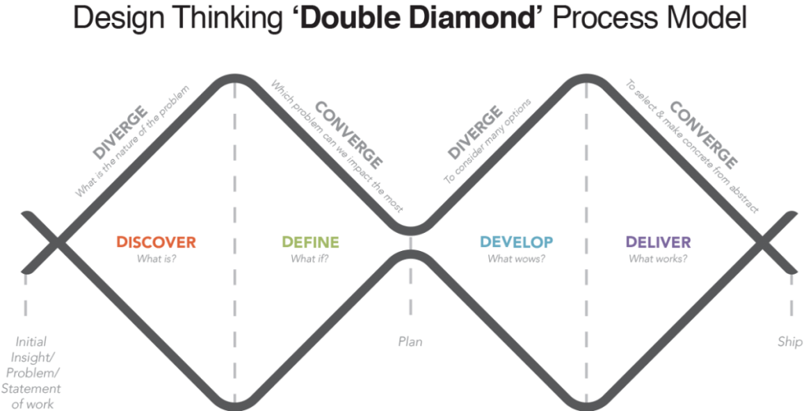
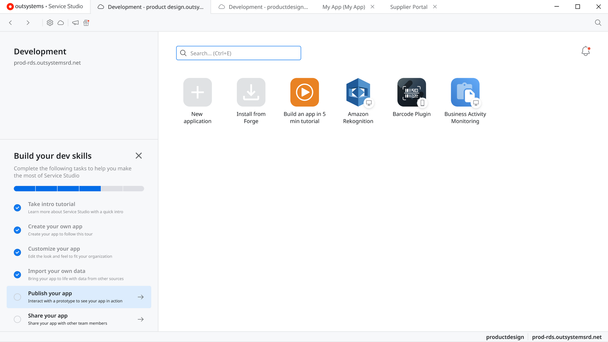
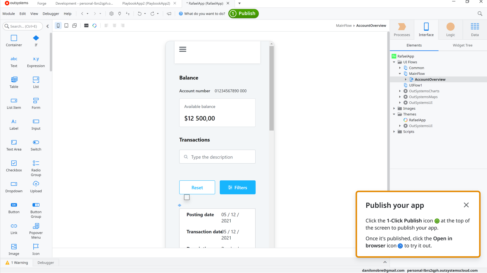
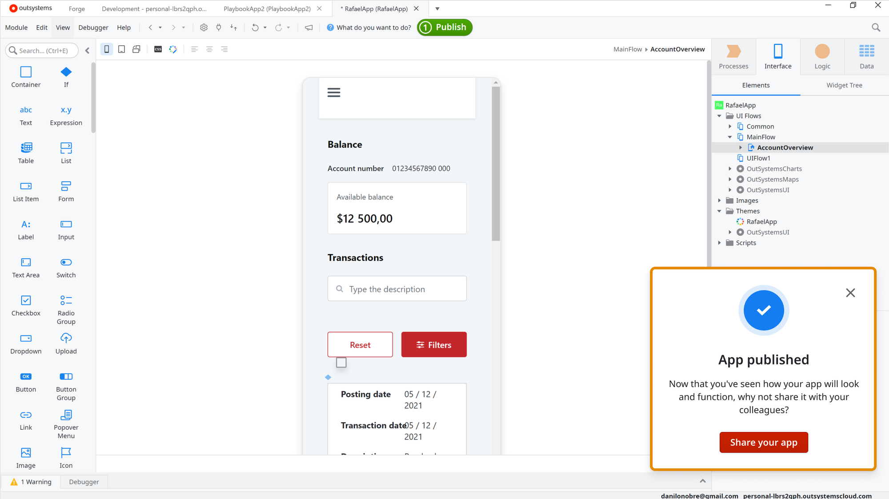
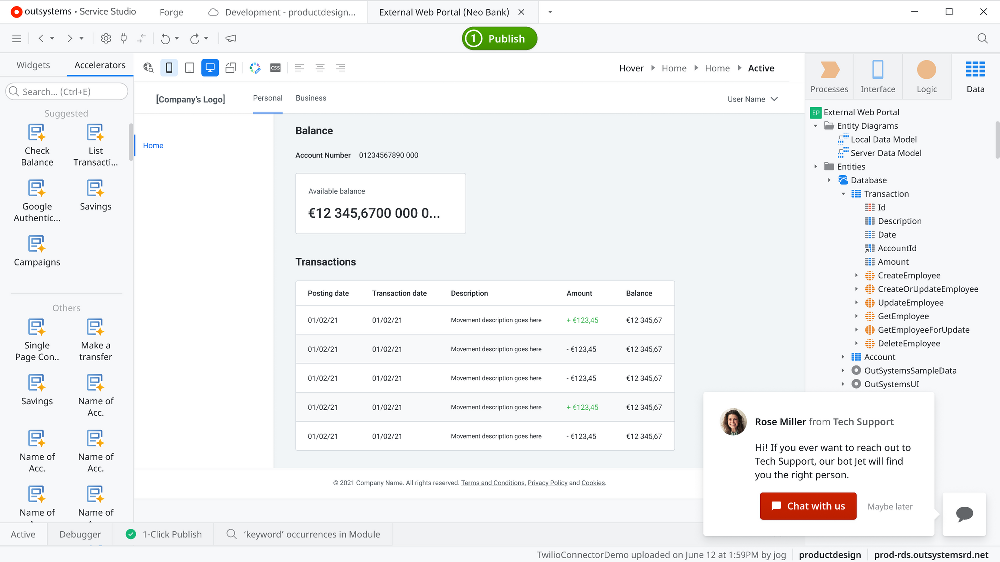
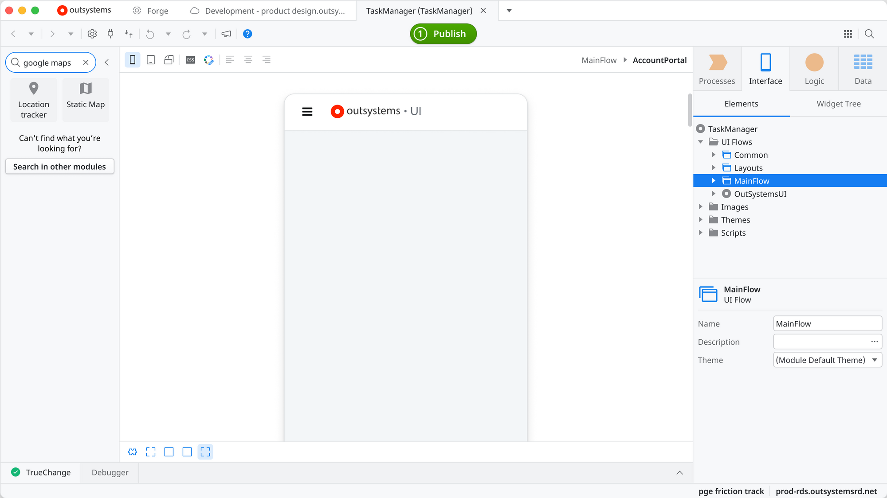
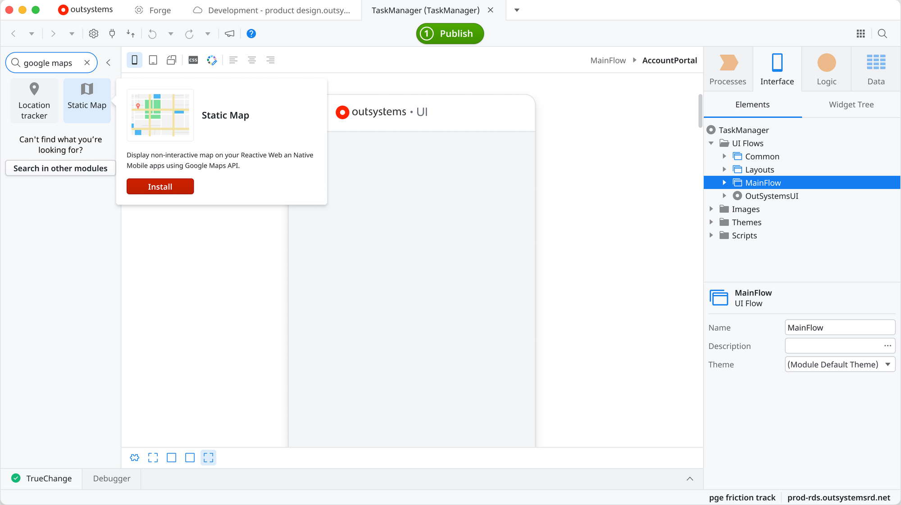
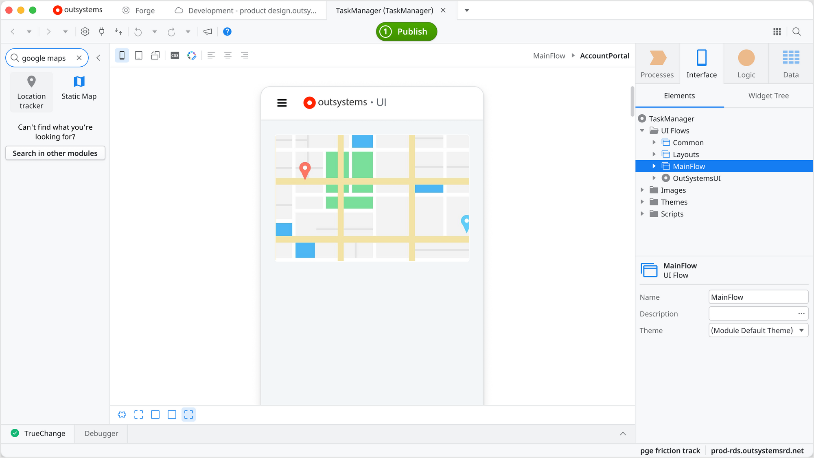

<meta name="robots" content="noindex, nofollow" />

## Growth

In my first period in Outsystems, I was placed in the Growth product team, which had the mission to lead prospects to become clients in a transition to turn OutSystems Product-Led-Growth. My work was based on creating solutions to (mainly) retain those prospects in the product’s journey.

## Workflow and methodologies

To develop the solutions, I was placed in an agile team where the initiatives we covered were discussed along with a trio composed of me as a product designer, a product owner, and a technical leader. Apart from this trio, we also had the developers, an agile coach, and a quality analyst. This team was responsible for developing and digesting results from the initiatives designed for each sprint.

Design thinking is the foundation of my work, starting from a problem spotted by the Product Owner or myself looking for opportunities in external and internal research or data analysis.

To refine my solutions i used to run some activities like usability tests and design reviews, to collect feedback from users and from product designer from other groups, what it was a crucial step because allowed us to keep the consistency between the product’s experience.

Once a solution was in good shape I presented it to the tech leader and the developers, to, after that, follow them up to solve doubts, check the design requirements and also to adapt when they faced some technical limitations.

Once published, usually after 15 days, me and the product owner gathers together to measure the results and decide what to do next, defining if it make sense to iterate on the design or even to end it.

## Some initiatives

### Playbook

Outsystems Service Studio is our main product, and since is the place the users develop their apps, our main use case, it demands a certain amount of time to have the first value perceived, so we designed a solution to offer guidance to help users to quickly reach first value. Following this we provided a playbook, a guide of tasks that the users could do to have a funcional app running, if well followed, in something like 5 minutes. After interacting with an available step we guided the user through the journey to accomplish that task, showing some popups telling what to do but not being so intrusive, allowing the just quit without any effort. After a task is completed we’ve presenting a popup leading to the next task.

### Sales team chatbot

I’ve done a research along with the sales team to understand their journey with the purpose of detecting pain points and opportunities.

It was detected that they had a lot of trouble triggering users that weren’t ready to buy the product, so the north star of this initiative was to try to qualify the users to help the sales team to talk with the right users. The way we found to do it was to, prompt the users depending on what the user was doing in the product, offering help, a path to unblock them or even reaching users that are having a high engagement with the product. So with these popups we would offer a journey to put the user in contact with the sales team though a chatbot, allowing the sales team to be triggered about users instead of the need to keep randomly triggering users.

For this solution i ran a lot of interviews with the sales team and had to go deep inside Drift (the chatbot) documentation.

### Forge components in Service Studio

Forge is an Outsystems tool that act like an app marketplace, allowing users to consume and share applications among the community. One strong pain point is that we don’t have a clear connection between these two tools (Service Studio and Forge), we only have some links but nothing so substantial, so it’s very tought to users to get to know Forge early in the journey.

To facilitate the Forge discoverability inside Service Studio we decided to show the top Forge resources available directly in the Service Studio’s toolbox, so the user would be able to easily install that resource directly and also would now Forge and its power.

For this solution i ran usability tests to be sure that the journey was simple and frictionless.

