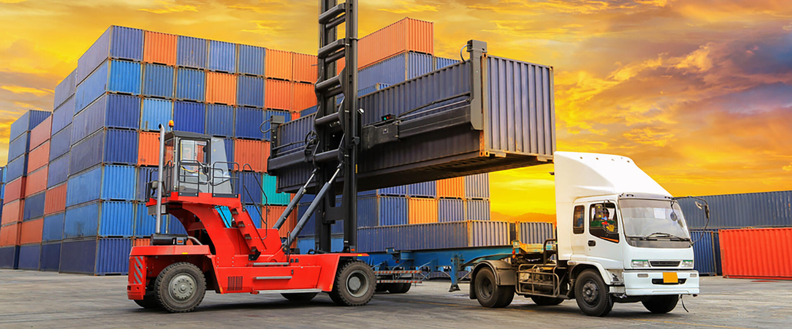

## Problem

VR worked under an old system and because it was built without any design concept, it demanded a lot of operational effort, either during the implementation of the system with the client
as during the monitoring operation, which was the main service of the system.

## The journey

I had a great facility, which was how accessible were those involved in the project, both professionals in executive and strategic positions as well as operational positions,
making it super accessible that I could meet with them to validate flows, watch the work of operators directly using the system,
and test the various design interventions proposed by me being used.

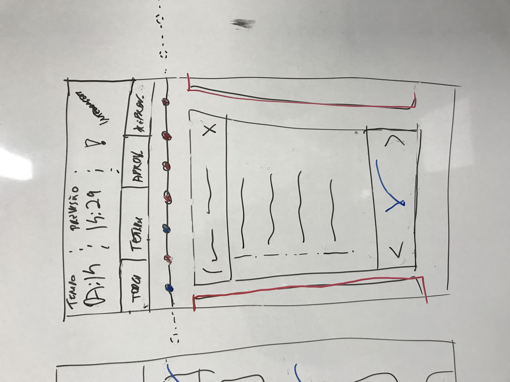

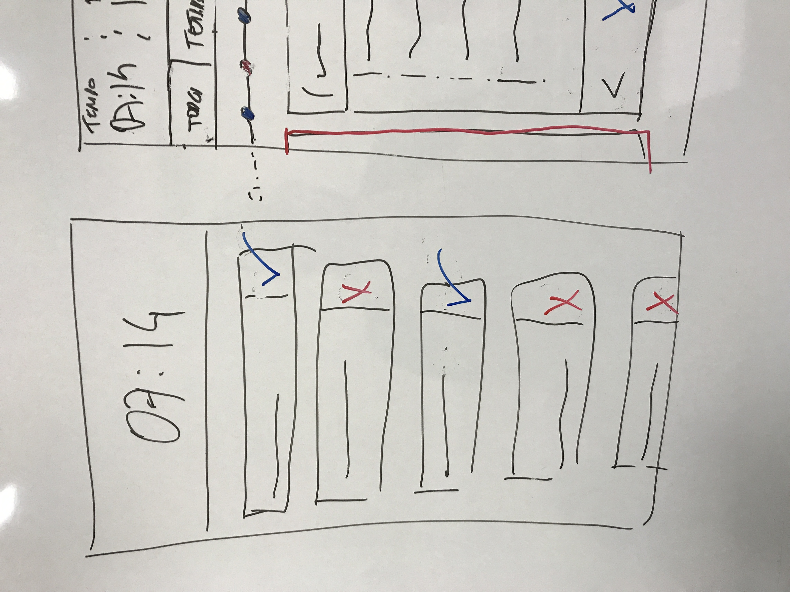

## Workflow

After being aligned with the system processes, it was time to create a design workflow with the VR team, so that together
we could work on the evolution of the project, but this time using all the power of design to make using the system a pleasant experience
and satisfactory, and that was when the first deliverables emerged, both visual (UI) and strategic (UX) deliveries.

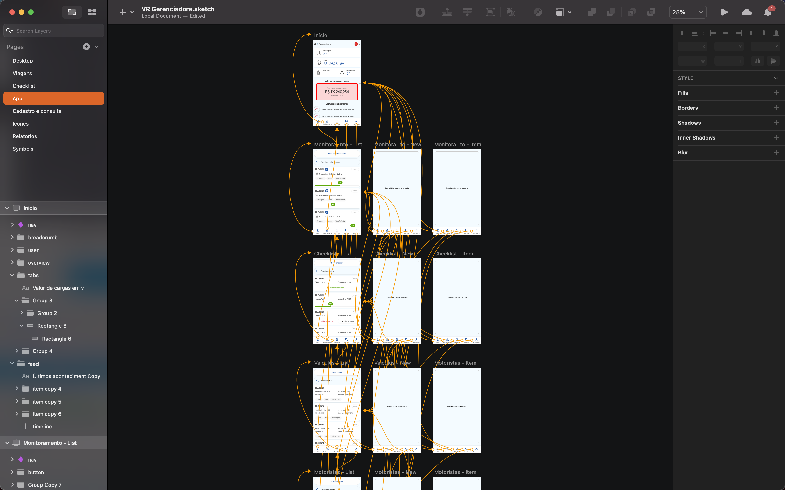

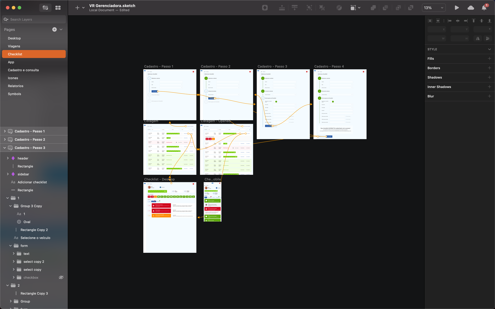

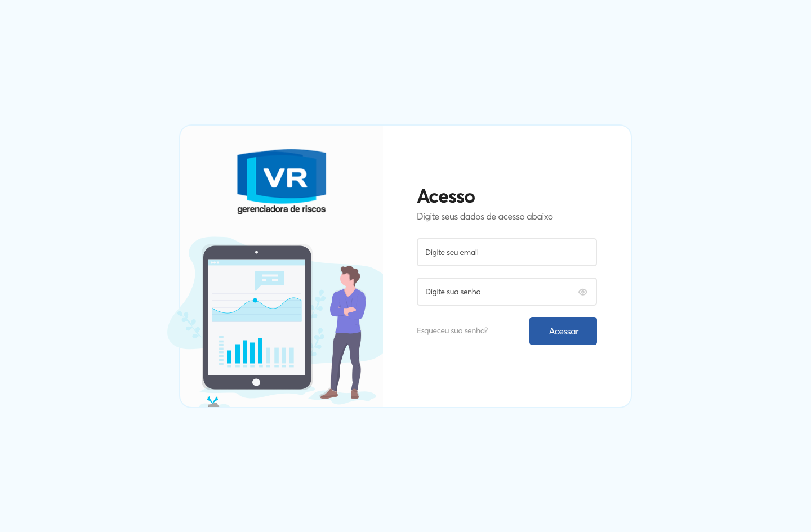

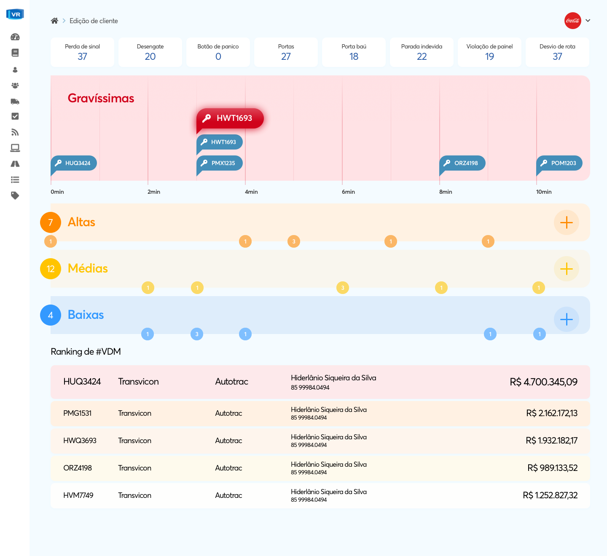

## Travel monitoring

As the design process progressed, we were able to involve the most sensitive points of the system, and that's when we arrived at the
Monitoring module, which was the heart of the system, the area of the system that was used for 24 hours by VR operators, since the
their job was to monitor the travels of customers' trucks, and it was in this module that they consumed all the information they needed to
that information make a decision in relation to travel, whether it be triggering the driver or triggering security authorities.

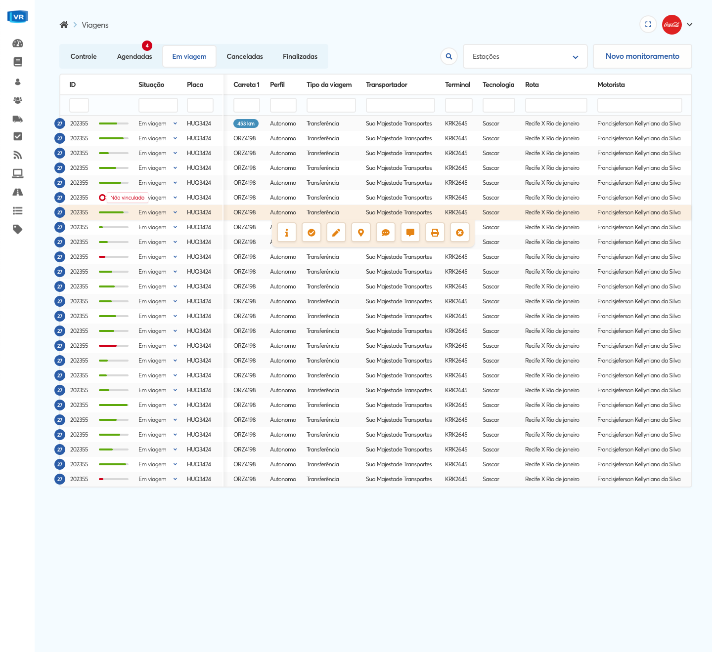

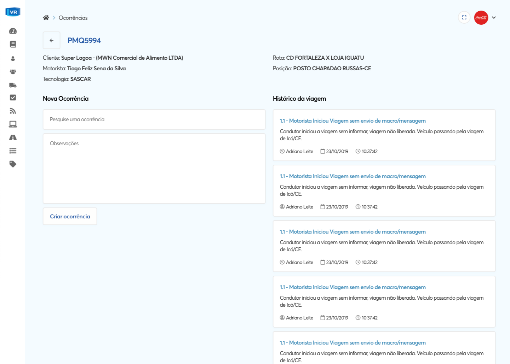

## Next steps

Now with a well-defined design flow and aligned with the team, and also with the consolidated design system approved with the owners
of the product and tested with the operational team, we were able to apply the new VR design to the other modules of the system, such as 'Registration and consultation',
a module in which the VR customer manages its drivers, including consulting the driver's criminal record.

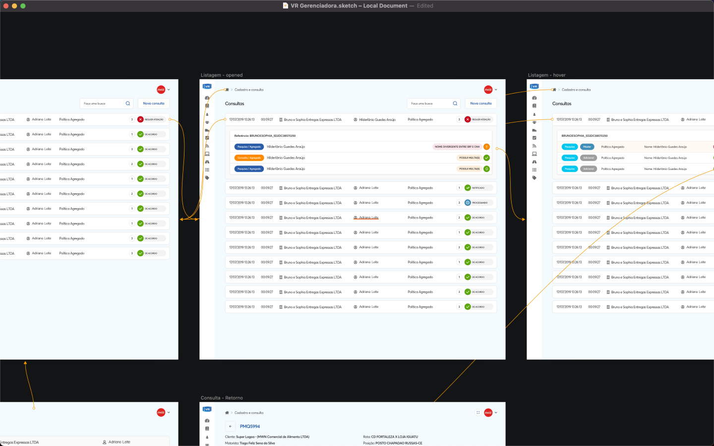

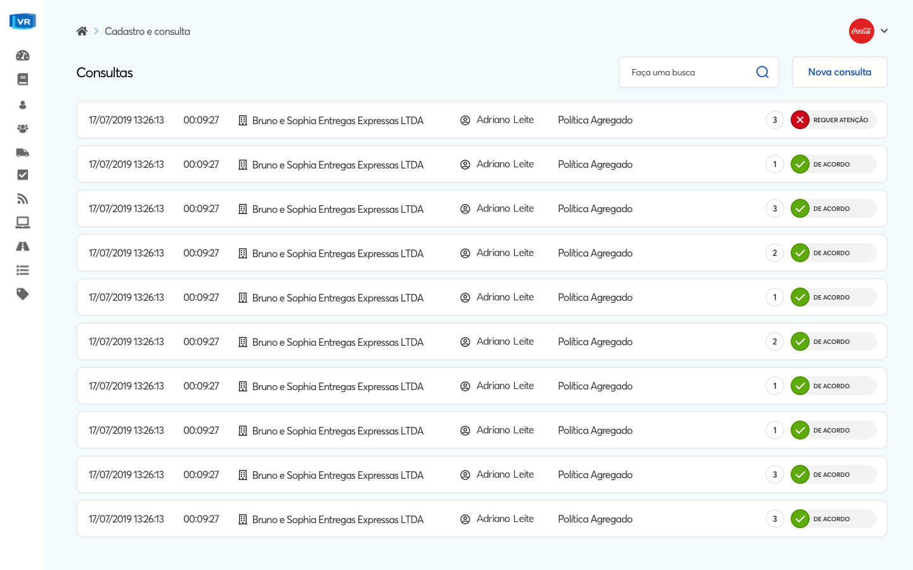

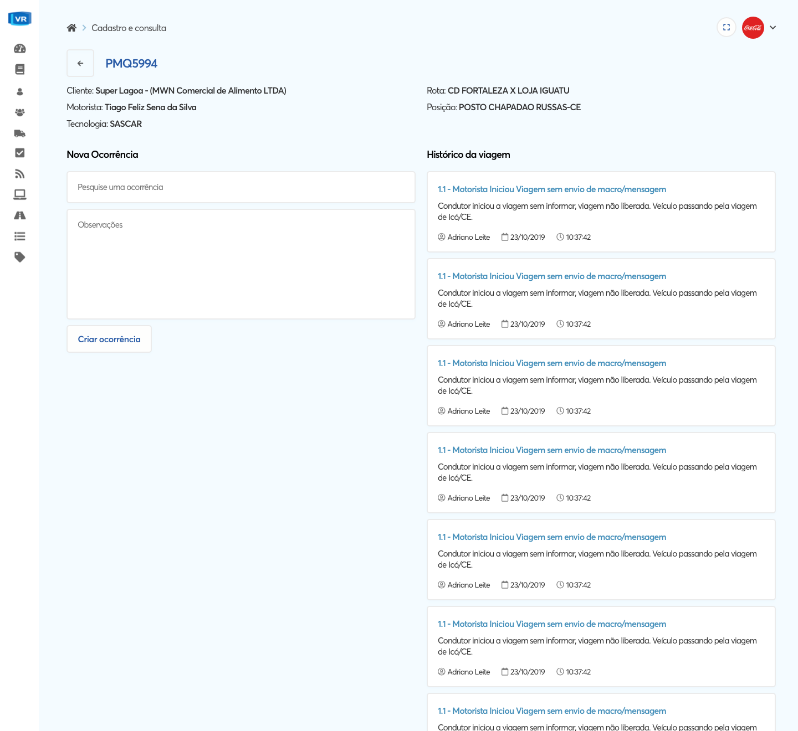

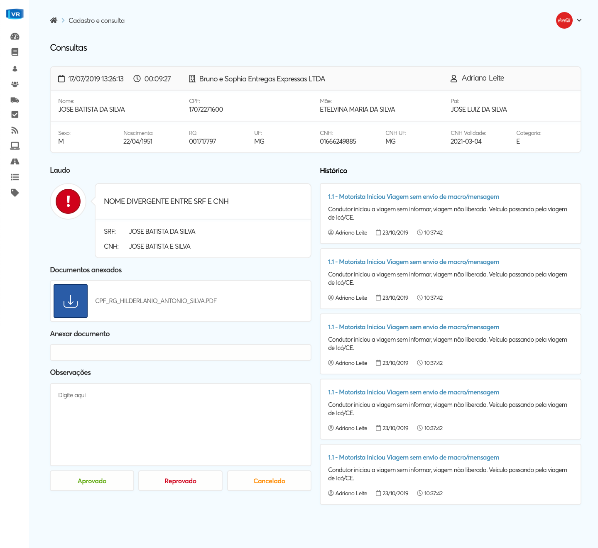

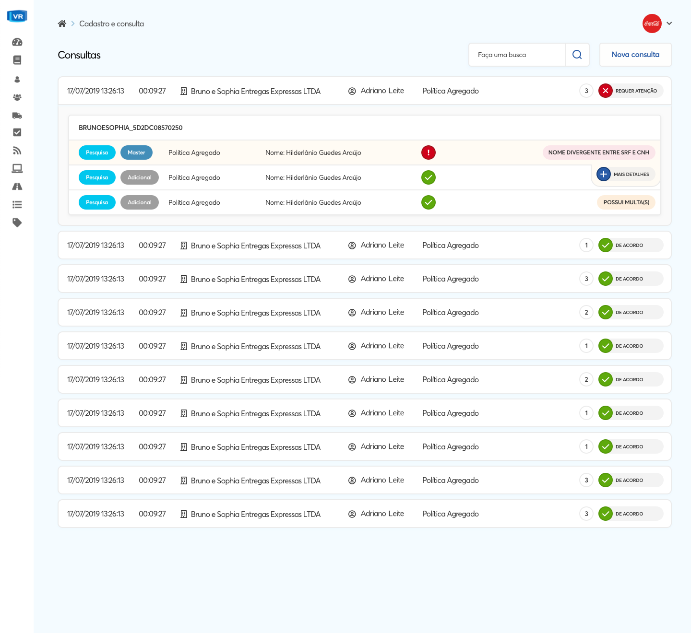

