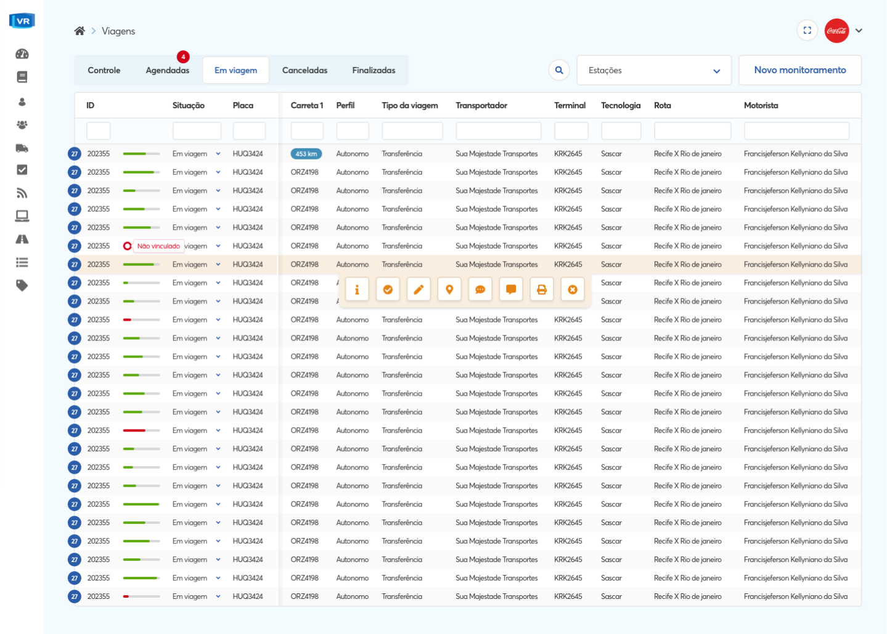

## Problem

A VR Gerenciadora funcionava sob um sistema antigo e que por ter sido construido sem nenhum conceito de design demandava muito esforço operacional, seja durante a implantação do sistema junto do cliente
como durante a operação de monitoramento, que era o principal serviço do sistema.

## The journey

Na VR eu tive uma grande facilidade que foi o quão acessíveis eram os envolvidos no projeto, tanto os profissionais de cargos executivos e estratégicos como dos cargos operacionais,
tornando super acessível que eu pudesse me reunir com eles pra validar fluxos, acompanhar o trabalho dos operadores diretamente com o sistema,
e testar as diversas intervenções de design propostas por mim sendo usadas.

## Workflow

Após ficar alinhado quanto aos processos do sistema foi a hora de criar junto com a equipe da VR um workflow de design, pra que juntos
a gente conseguisse trabalhar a evolução do projeto, mas dessa vez usando todo o poder do design pra tornar o uso do sistema uma experiência agradável
e satisfatória, e foi aí que surgiram os primeiro entregáveis, tanto entregas visuais(UI) quanto estratégicas (UX).

## Monitoramento de viagens

A medida que o processo de design ia avançando nós iamos conseguindo envolver os pontos mais sensíveis do sistema, e foi aí em que chegamos no
módulo de Monitoramento, esse que era o coração do sistema, a área do sistema que era usada durante 24horas pelos operadores da VR, já que o
trabalho deles era monitoras as viagens dos caminhões dos clientes, e era nesse módulo que eles consumiam todas as informações que precisavam para com
essas informações tomar uma decisão em relação às viagens, sejam acionar o motorista ou acionar autoridades de segurança.

## Próximos passos

Agora com um fluxo de design bem definido e alinhado com a equipe, e também com o design system consolidado, aprovado com os proprietarios
do produto e testado com a equipe operacional, pudemos aplicar o novo design da VR nos demais módulos do sistema, como por exemplo o 'Cadastro e consulta',
um módulo em que o cliente da VR faz uma gestão dos seus motoristas, inclusive consultando antecedentes criminais do motorista.

